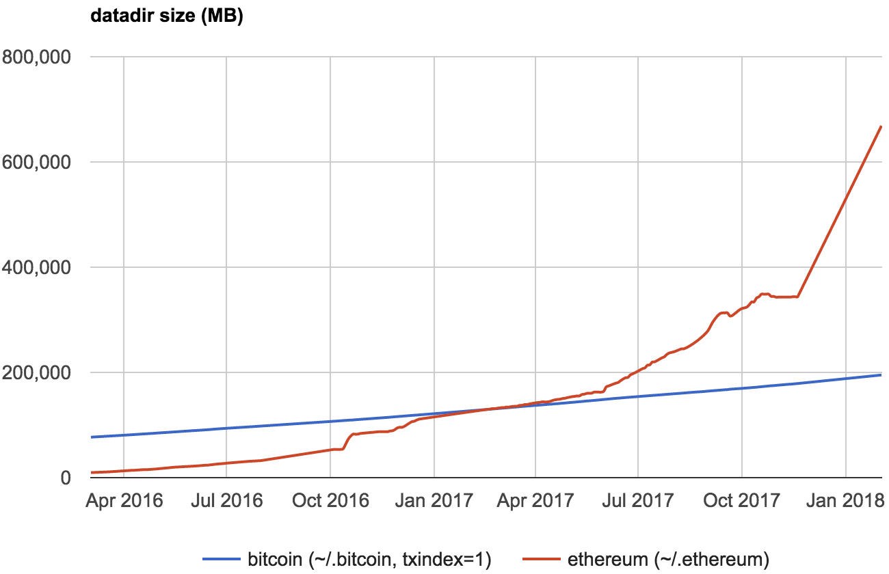
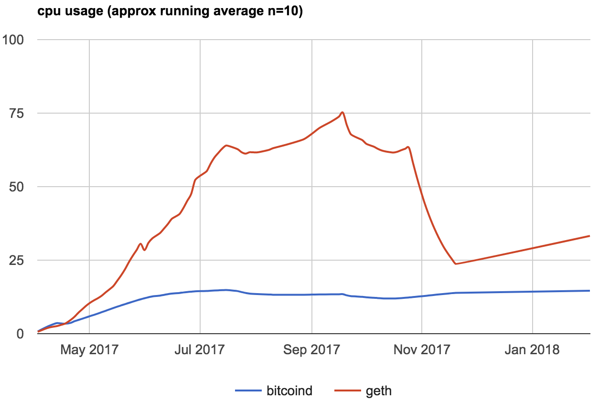
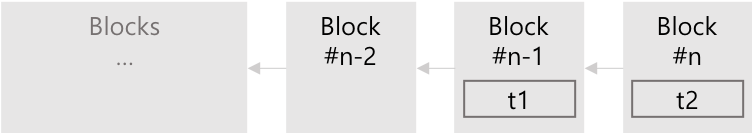
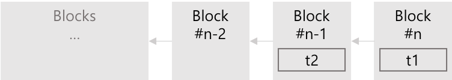
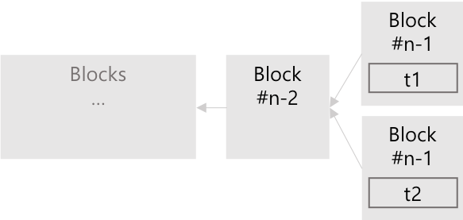
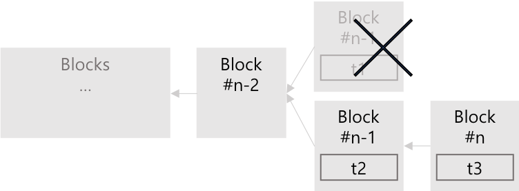
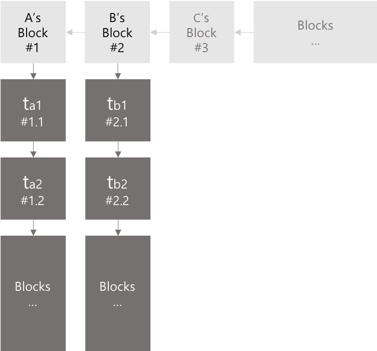
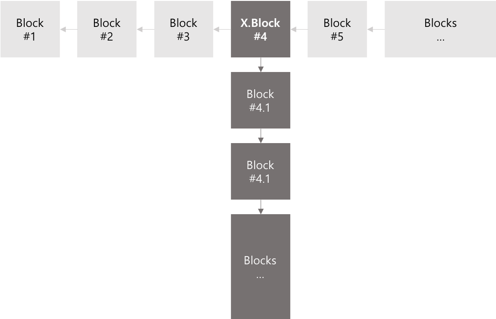

# X.Blockchain Technical White Paper v1
Yongseok Kwon  
April 24, 2018  

*Copyright © 2018 XBLOCK SYSTEMS CO., LTD.*  
*Without permission, anyone may use, reproduce or distribute any material in this white paper for non-commercial and educational use (i.e., other than for a fee or for commercial purposes) provided that the original source and the applicable copyright notice are cited.*  

**DISCLAIMER:** This X.Blockchain Technical White Paper is for information purposes only. XBLOCK SYSTEMS does not guarantee the accuracy of or the conclusions reached in this white paper, and this white paper is provided "as is". XBLOCK SYSTEMS does not make and expressly disclaims all representations and warranties, express, implied, statutory or otherwise, whatsoever, including, but not limited to: (i) warranties of merchantability, fitness for a particular purpose, suitability, usage, title or noninfringement; (ii) that the contents of this white paper are free from error; and (iii) that such contents will not infringe third-party rights. XBLOCK SYSTEMS and its affiliates shall have no liability for damages of any kind arising out of the use, reference to, or reliance on this white paper or any of the content contained herein, even if advised of the possibility of such damages. In no event will XBLOCK SYSTEMS or its affiliates be liable to any person or entity for any damages, losses, liabilities, costs or expenses of any kind, whether direct or indirect, consequential, compensatory, incidental, actual, exemplary, punitive or special for the use of, reference to, or reliance on this white paper or any of the content contained herein, including, without limitation, any loss of business, revenues, profits, data, use, goodwill or other intangible losses.  

<br /><br />

**Abstract:** Bitcoin의 등장과 이를 이용한 거래의 급증은, 블록체인 기술이 거래 원장으로서 신뢰 할 수 있을 만큼 충분히 안전하다는 것을 증명하였다. 블록체인 기술이 주목 받게 된 주된 이유는, 기존 방식과 달리 신뢰성 확보 문제에 있어서 제3의 신뢰기관 (Trusted Third Party, TTP) 을 제거 하였다는 것과, 모든 거래 내역이 네트워크에 참여하는 모든 참여자들에게 분산 저장됨으로 거래 내용에 대한 조작이 사실상 불가능 하도록 만들었다는 점이다.  
블록체인 기술에서 가장 중요한 핵심 개념은 ‘Decentralization (탈 중앙화)’ 과 ‘Distributed Ledger (분산원장)’ 개념이다. 기존 방식은, 모든 거래가 하나의 집중화된 중앙 서버에 기록 되고, 해당 거래의 신뢰는 이 중앙서버 (제3의 신뢰기관) 에 의하여 ‘보증 되는’ 방식 이였다. 그러나 블록체인 상에서 발생한 거래는 네트워크에 참여하는 모든 참여자들에게 전달되어 ‘검증’, ‘합의’되고, ‘블록’ 단위로 묶여 순차적(선형적)으로 연결된다.  
모든 거래 내역이 기록 되는 블록체인의 크기는 누적 거래 건수가 증가 할수록, 즉 시간이 지날수록 점차 커질 수 밖에 없으며, 이는 네트워크의 모든 참여자가 전체 블록체인을 저장 관리 하는 것이 사실상 불가능해 지는 시점이 언젠가 도래함을 의미한다. 즉 블록체인 전체를 저장 관리 할 수 있을 만큼의 성능을 갖춘 시스템(노드)는 점차 그 수가 줄어 상대적으로 소수의 노드 집단을 이루게 될 가능성이 크다. 그리고 이 것은 또 다른 형태의 중앙 집중화의 결과를 가져올 것이다. 상대적으로 소수의 노드 집단이 전체 블록체인을 관리 하게 되는 상황에서 거래의 신뢰성은 이 소수의 노드 집단에 의존할 수 밖에 없게 된다. 즉, 블록체인의 근본 개념인 ‘탈 중앙화’ 가 심각히 훼손 될 수 있음을 의미한다.  
**본 문서는 특별히 전자문서의 보호를 위한 블록체인 기술 응용에 있어서,블록체인 연결구조를 기존의 선형적인 구조에서 다차원 구조로 변형한 X.Blockchain 을 제안 함으로서 전체 블록체인 크기 문제와 그로 인한 노드 집중화 문제에 대한 해결책을 모색 하고자 한다.**

<br />

<!-- MarkdownTOC depth=4 autolink=true bracket=round list_bullets="-*+" -->
## Table of Contrents

- [Problems](#problems)
- [Background](#background)
- [X.Blockchain Overview](#xblockchain-overview)
  * [Block Header](#common-block)
  * [X.Block](#xblock)
  * [X.Transaction](#xtransaction)
- [Consensus Algorithm](#consensus-algorithm)
- [Inter SubChain Communication](#inter-subchain-communication)
- [Coin Model](#coin-model)
- [Accounts](#accounts)
- [Reward Policy](#mining)
- [Development Roadmap](#development-roadmap)

<br />
<br />

## Problems

블록체인의 크기는 시간이 지날수록 거래의 누적 건수에 비례하여 지속적으로 증가할 수 밖에 없다. 블록체인 네트워크에 참여하는 모든 노드에 원장이 분산 저장 관리 되고, 이를 통해 제3의 신뢰기관 없이 거래에 대한 신뢰 확보가 가능하다는 블록체인 근본 개념에 충실하고자 할 때, 계속 증가되는 블록체인의 크기 문제는 거래 검증을 위한 노드의 참여에 있어서 한계 상황을 발생 시키게 된다. 즉 거대해진 블록체인을 저장 관리하는 완전노드<sup id="a1">[1](#f1)</sup>  로서 참여하기 위해서는 저장공간 확보와 같은 일정한 수준 이상의 성능이 요구된다. 이 성능 수준은 블록체인의 크기에 비례하여 지속적으로 상향 조정될 것이므로 참여 노드의 수적 감소는 불가피하게 되고 결, 또 다른 ‘중앙 집중화’ 형태로 귀결 될 수 밖에 없게 된다<sup id="a2">[2](#f2)</sup>. 2017년 5월 현재 Bitcoin의 거래를 포함한 전체 블록체인 크기<sup id="a3">[3](#f3)</sup> 는 이미 150G를 넘어섰고, Ethereum 의 블록체인 데이터는 최근 600G를 넘어섰다.
<br />



Figure 1. Bitcoin & Ethtereum blockchain size (출처:http://bc.daniel.net.nz/)

<br /><br />



Figure 1. Bitcoin & Ethtereum blockchain size (출처:http://bc.daniel.net.nz/)

<br /><br />

이러한 일정 수준의 '자격조건'은, 절대 다수의 사용자 클라이언트 (모바일 디바이스 포함)로 하여금 블록체인 네트워크에 완전 노드로서 참여 하는 것을 사실상 불가능하게 만든다. 결과적으로 사용자 클라이언트는 거래에 대한 신뢰 여부를 스스로 (제3의 신뢰기관 없이) 판단하지 못하고, 상대적으로 소수인 완전 노드 집단에 ‘의뢰’ 해야 만 하며, 그 결과를 일방적으로 ‘수용’ 해야 한다. 여기서 소수의 완전 노드 집단은 ‘제3의 신뢰기관’ 처럼 작동한다.
이런 ‘완전 노드의 집중화’ 문제의 배경에는 앞서 언급한 바와 같이 거대해진 전체 블록체인의 저장과 블록 생성(채굴) 시 요구되는 높은 computing power가 원인으로 자리 잡고 있다. 여기서 다시 전체 블록체인의 저장이 요구되는 이유는, 블록체인의 구조가 선형적인 연결 구조로 이루어져 있기 때문에 정작 필요한 블록들만 따로 떼어내는 것이 불가능 하기 때문이다. 중간 연결 관계가 끊긴 블록의 집합은 어떤 신뢰도 확인해 줄 수 없기에 아무런 가치를 갖지 못한다.
이러한 블록체인의 특성은, 그 것이 갖는 뛰어난 혁신성에도 불구하고, 여러가지 비효율을 감수하도록 한다. 예를 들어 어느 회사에서 내부 부서 활동 기록을 기록하여 관리하고자 어떤 공개 블록체인(Public Blockchain)을 활용하기로 결정하였다고 가정하자. 이 회사에서 운영하는 블록체인 노드에는 자신의 기록과는 상관없는, 전세계적으로 이 공개 블록체인 상에 발생되고 있는 수 많은 트랜잭션 전체가 저장되어야 한다. 그리고 이 전체 블록체인 데이터는 아마도(거의 확실하게) 이 회사가 발생시킨 트랜잭션보다 수 백, 수천 만배는 더 클 것이다. 이 회사 입장에서 보자면 불필요한, 그러나 자신이 발생시킨 데이터와는 비교도 안될 만큼의 큰 데이터를 저장 관리 해야 하는 것이다.
이러한 문제를 해결하기 위해 비공개 블록체인(Private Blockchain) 활용을 검토해 볼 수 있다. 물론 비공개 블록체인 역시 중요한 그리고 충분한 가치를 갖지만, 앞서 제기한 문제 이상으로 중앙 집중화된 구조를 갖는다는 점에서 우리가 바라는 해결책은 아니다.

우리는 공개 블록체인과 같은 수준의 분산 구조를 유지하면서, 하나의 단일한 블록체인 네트워크상에 제출(발생) 되는 모든 트랜잭션들을 유의미한 관계를 갖는 트랜잭션들의 집합을 구성하고, 각각의 집합에 포함된 트랜잭션들로 이루어진 독립적이고 개별적인 블록체인들의 연결 구조를 제안한다. 이로서 하나의 단일한 공개 블록체인 네트워크에 참여하는 모든 노드가 반드시 전체 블록을 관리해야 하는 제약 사항에서 벗어나, 선택적인 블록체인 구성 및 관리가 가능한 구조와 방법을 제시하고자 한다.

X.Blockchain 은, 발생되는 모든 기록(Transaction) 을 반드시 하나의 선형적인 구조로 구성하는 것을 강제 하지 않는다. 이는 트랜잭션에 따라 의도적으로 분기(fork) 를 허용함으로서, 유의미한 관계를 갖는 Transaction 들로 이루어진 개별적인 블록체인 구성이 가능함을 의미한다.
예를 들어 ‘문서’를 기준으로 하였을 때, 각 문서의 ‘최초 생성’ 은 기존 블록체인과 동일한 선형적인 구조의 블록체인(MainChain) 에 기록된다. 그러나 이미 MainChain에 기록된 특정 문서에 대하여 발생한 변경 등의 추가 기록(Transaction)은, MainChain이 아닌 MainChain 상의 해당 블록을 genesis block 으로 하는 또 다른 블록체인인 SubChain상에 기록 된다.
다시 앞서 제시한 예를 들자면, 공개 블록체인 상에 내부 활동 기록을 관리하고자 하는 회사에서는 이미 존재하는 MainChain 에 자신의 블록체인의 Gennesis Block 으로 사용될 블록을 생성하고, 그 블록을 시작으로 하는 별도의 SubChain을 구성하여 여기에 회사 내부 활동 기록을 저장 관리 한다. 이로서 회사는 다른 목적을 갖는 트랜잭션 및 블록의 저장을 최소화 할 수 있다.

<br /><br />

## Background

기존의 블록체인에서 분기(fork)는 블록에 기록된 데이터의 일관성(consistance)을 훼손 시킨다. 분기되어 같은 블록 높이(block height)를 갖는 복수의 블록이 존재한다는 것은 특정 시점에 단일한 대상이 복수의 서로 다른 상태값을 동시에 갖는다는 것을 의미하며 이것은 그 자체로 모순이다. 즉 'A 계좌 잔고가 현재 2백만원이면서 동시에 3백만원이다' 라고 정의하는 것과 다름 아니다. A계좌에서 250만원을 인출했다고 하자. 인출 후 A 계좌의 잔액은 얼마인가? 그 전에 인출이 가능한가?
이러한 문제를 피하기 위해서는 동일한 대상의 상태를 변경하는 사건들은 반드시 순차적으로 처리되어야 한다. 상태를 변경시키는 임의의 사건에 대한 처리가 완료되어 상태 변경이 확정된 이후 또 다른 사건에 대한 처리 결과가 앞서 변경된 상태에 추가적으로 반영되어야 함을 의미한다.
예를 들어 A의 상태를 S<sub>A</sub>, 이를 변경하는 사건들의 집합을 T<sub>A</sub>라 하고, 개별 사건 t ($t \in T_{A}$) 에 의하여 변경된 A의 상태를 S<sub>A,t</sub> 라 하자. 복수의 사건 t1 과 t2 를 가정하였을 때, 사건 t1 의 처리가 완료되어 A의 상태가 S<sub>A,t1</sub> 으로 확정된 이후에 사건 t2 의 처리가 진행되어야 한다. t2가 선행하여 발생하는 경우도 마찬가지 이다. t2 의 처리 결과로서 A의 상태가 S<sub>A,t2</sub>로 확정된 상황에서 t1 처리가 진행되어야 한다.

<br />
$$
\begin{array}{c}
T_A = \{t1, t2, \space ...\}, \\\\\\
S_{A,t0} \xrightarrow{t1} S_{A,t1} \xrightarrow{t2} S_{A,t2} \\
or \\
S_{A,t0} \xrightarrow{t2} S_{A,t2} \xrightarrow{t1} S_{A,t1}
\end{array}
$$
<br />

이것을 블록 구조로 표현하면 다음과 같다.

<br />
<center>

<br /> or <br /><br />

</center>
<br />

그러나 S<sub>A</sub> 에 대하여 t1 의 처리가 완료되기 이전에 t2 에 대한 처리가 동시에 이루어진다면, 사건 t1 이 처리되는 시점의 A의 이전 상태를 S<sub>A,t0</sub> 라 할 때, 사건 t2 가 처리되는 시점의 A의 이전 상태 역시 S<sub>A,t0</sub> 가 되므로, S<sub>A,t0</sub>는 S<sub>A,t1</sub> 와 S<sub>A,t2</sub> 두가지 상태로 분기된다. 이는 전형적인 이중 지불 문제가 발생한 경우에 해당된다. 이 문제를 해결하기 위해서는 특정 시점(block height = #n-1) 에서 S<sub>A</sub>는 오직 하나로 강제 되어야 한다.

<br />
$$
\left .
\begin{array}{c}
S_{A,t0} \xrightarrow{t1} S_{A,t1} \\\\
S_{A,t0} \xrightarrow{t2} S_{A,t2}
\end{array}
\right \} \space \text{What is real ?} \space\space S_{A,t1} \space\space or \space\space S_{A,t2}
$$

<br />
<center>

</center>
<br />

즉 S<sub>A</sub>의 최종 상태는 S<sub>A,t1</sub> 과 S<sub>A,t2</sub> 둘 중 어느 하나로 결정되어져야 하며, 결과적으로 사건 t1, t2 중 어느 하나는 취소(무효화) 되어야 함을 의미한다.

<br />
<center>

</center>
<br />

이는 동일한 대상의 상태 변경을 일으키는 모든 사건은 동시성을 가질 수 없으며 반드시 순차적인 처리가 강제 되어야 한다는 것을 설명해 준다.

암호 화폐 거래의 경우, 사건(거래)는 어느 하나의 계정의 상태(잔고)를 변경하는 것이 아니라, 송금 계정과 수취 계정를 포함하는 복수의 계정 상태를 변경하고, 하나의 계정은 자신을 제외한 다른 모든 계정과 거래가 가능하다. 거래 t1: A -> B 와 거래 t2: A -> C 가 있을 때, t1 은 A와 B의 상태(잔고)를 동시에 변경한다. 따라서 A와 B의 상태를 변경하는 다른 사건들과 동일한 사건 집합에 속하게 된다. 동시에 t2 역시 A 와 C의 상태를 동시에 변경하므로 A와 C를 변경하는 다른 모든 사건들과 동일한 사건 집합에 속하게 된다. 결과적으로 t1, t2를 포함하여 A, B, C 의 상태를 변경하는 사건은 모두 하나의 동일한 사건 집합에 속하게된다. 만일 t3: D -> E 를 가정한다면, 이 사건 자체에 대해서는 t3를 별개의 다른 사건 집합으로 구분 할 수 있지만, D 또는 E 는 A, B, C 와의 거래가 잠재적으로 가능 하므로, 결국 A, B, C, D, E 에 대한 사건들은 잠재적으로 단일한 사건 집합을 구성 하게 된다.
즉, 임의의 사건으로 인한 특정 계정의 상태 변환은 '임의의 또 다른 계정'의 상태 변환을 수반 한다. 여기서 '임의의 또 다른 계정'이란 잠재적으로 다른 모든 계정을 포함 하게 된다. 때문에 개별 사건의 순차성이 보장되어야 하는 사건 집합 T는 단일한 하나의 사건 집합으로 관리되어야 한다. 결국 여기서 상태 관리의 대상은 각 개별 계정이 아닌, 계정간의 거래를 내용으로 하는 단일한 '거래 원장' 인 것이다.

<br /><br />

## X.Blockchain Overview

* **MainChain**: 선형적인 블록연결 구조로 구성된 상위 블록체인으로 복수의 SubChain을 가질 수 있다. MainChain 은 또 다른 상위 MainChain의 SubChain일 수 있다.
* **SubChain**: MainChain의 특정 블록을 genesis 블록으로 하여 구성된 독립적인 블록체인. SubChain은 또 다른 하위 SubChain의 MainChain이 될 수 있다.
* **X.Block**: 블록체인을 구성하는 블록중 SubChain 의 Genesis Block 역할을 하는 블록.
* **X.Transaction**: X.Block을 생성하기 위한 트랜잭션.
* **Full Node**: MainChain 과 전체 하위 SubChain의 블록을 관리하는 노드.
* **Sub Node**: 특정 SubChain의 블록만 관리하는 노드.
* **Blockchain Depth**: 노드가 관리하는 최상위 블록체인을 기준으로 관리 하고자 하는 SubChain의 Depth.

앞서 기존의 블록체인이 선형적인 구조에 한정될 수 밖에 없었던 이유를 이중 지불 문제를 중심으로 하여 살펴 보았다. 동일한 대상의 상태 변경을 일으키는 모든 사건은 동시성을 가질 수 없으며 반드시 순차적인 처리가 강제 되어야 한다는 것이 그것이다.
그러나 서로 다른 대상의 상태를 변경하는 사건들의 경우, '반드시' 순차적으로 처리 되어야 할 필요가 없다. 예를 들어 각각 독립적으로 존재하는 '문서'를 대상으로 할 경우, 특정 문서의 상태 변경이 다른 문서의 상태 변경과 의미있는 관계를 갖지 않는다[^문서변경]. 개별 사건들이 오직 하나의 대상 (여기서는 특정 문서) 에 대해서만 적용되기 때문에, 사건들은 서로에 대하여 동기화 될 필요가 없다. 다시 말해서 다수의 문서들의 각 상태가 동시에 변경되어도 앞서 언급한 이중 지불 문제와 같은 모순은 발생되지 않을 것이다. 사건의 순차적인 처리는 동일한 대상의 상태 변환을 일으키는 사건들 사이에서만 의미를 갖기 때문이다.

[^문서변경]: 문서간의 상호 참조와 같은 것이 존재하는 경우, 문서 내용의 변경은 그것을 참조하는 다른 문서의 내용 변경을 발생시킨다고 볼 수 있으나, 이 때 문서간의 상호참조 관계는 문제는 각 문서의 개별적 상태일 뿐, 동일한 사건 집합에 포함되어야 할 조건으로서 동일한 상태변환 대상이 아니다.

이것은 복수의 서로 다른 대상(문서) A, B, C ... 각각의 사건 집합을 T<sub>A</sub>, T<sub>B</sub>, T<sub>C</sub>, ... 이라 할 때, 각각의 사건 집합은 하나의 독립적인 선형 구조로 구성되는 것이 가능함을 의미한다. 즉, 서로 다른 사건 집합 T<sub>A</sub> 과 T<sub>B</sub> 에 속하는 사건 t<sub>a1</sub> 과 t<sub>b1</sub> 은 서로에 대하여 순차적으로 처리되어야 할 필요도, 동일한 직렬화 구조에 포함될 필요도 없다.

<br />
$$
\begin{array}{c}
T_A = \{t_{a1}, t_{a2},\space...\}, \space\space T_B = \{t_{b1}, t_{b2},\space...\}, \\\\ T_A \cap T_B = \emptyset , \\\\\\
A's \space blockchain : S_{A,t_{a0}} \xrightarrow{t_{a1}} S_{A,t_{a1}} \xrightarrow{t_{a2}} S_{A,t_{a2}}  \cdots\\\\
B's \space blockchain : S_{A,t_{b0}} \xrightarrow{t_{b1}} S_{A,t_{b1}} \xrightarrow{t_{b2}} S_{A,t_{b2}} \cdots
\end{array}
$$
<br />

<center>

</center>
<br />

X.Blockchain은 분기(fork)를 허용한다. 이로서 개별적인 사건 집합 T 에 대하여 독립적인 블록체인 구성을 가능하게 한다. 이 독립적인 블록체인을 SubChain 이라 하고, SubChain 의 genesis block 들로 이루어진 블록체인을 MainChain 이라 한다. SubChain 은 그 자체로 독립적이고 완전한 하나의 블록체인으로 기능한다. 각각의 SubChain 에 적용되는 모든 메커니즘은 SubChain 상에서 또 다른 X.Block 을 생성하는 것을 포함하여 MainChain 상의 그것과 완벽히 동일하다.

#### MainChain
선형 구조의 일반적인 블록체인과 동일한 구조를 갖는다. MainChain 은 애스톤 코인의 거래 내역을 포함하여 다양한 기록을 순차적으로 기록하면서 여타의 블록체인과 동일한 방식으로 블록 연결의 확장을 통해서 성장한다. 그러나 MainChain 의 블록중 분기가 가능한 특수한 블록이 생성 도리 수 있는데, 이 블록을 시작으로 하여 또 다른 블록의 연결 및 확장이 시작 될 수 있다.

#### SubChain
SubChain 은 MainChain 상에 존재하는, 분기가 가능한 특수한 블록으로 부터 시작되는 또 다른 블록 연결 및 확장이다. MainChain 의 특수한 블록으로 부터 시작된 복수의 블록체인은 이후 독립적인 사건집합에 속하는 트랜잭션들로 구성된 각각의 블록을 생성하게 되고, 생성된 블록은 각 블록체인의 마지막 블록에 연결되므로서 동기화 되지 않는 독립적인 블록체인을 구성하게 된다. 이 때 독자적인 블록 연결 및 확장이 가능한 복수의 블록체인중 기존의 사건집합과 서로소 집합 관계에 있는 새로운 사건 집합에 대한 블록체인을 SubChain 이라 한다. SubChain 은 그 자체로 하나의 완전하고 독립적인 블록체인이다.
SubChain 상에서의 모든 기능과 합의에 도달하는 메커니즘은 MainChain의 그것과 완벽하게 동일하다. MainChain 과 마찬가지로 SubChain 상에서도 X.Block 생성이 가능하기 때문에 SubChain 은 또 다른 SubChain 의 MainChain 될 수도 있다. 이로서 X.Blockchain 은 다차원적인 블록체인 구조로 발전 할 수 있다. 또한 SubChain 역시 고유의 자산을 가질 수 있다. 이 것을 SubCoin 이라 한다. SubCoin 은 MainChain 의 애스톤 코인과 동일한 메커니즘에 의하여 생성, 전송 될 수 있지만, 애스톤 코인과 동일한 코인은 아니다.

#### X.Block
분기가 가능한 특수한 블록을 X.Block 이라 한다. 특정 X.Block 으로 부터는 오직 하나의 SubChain 이 시작될 수 있다. 그러나 SubChain 은 또 다른 X.Block 을 포함할 수 있어 다차원적인 블록체인 구조로 발전할 수 있다.

<br />
<center>

</center>
<br />


*Note: <Ex.Block(common) 과 차이 -> double hash link 필요한 이유 설명>*

앞서 설명한 바와 같이, 암호 화폐 거래는 분기가 허용되는 블록체인 구조에서는 처리가 불가능하다. 다시 설명하면,


 동일한 사건 집합에 속하는 사건들 사이에는 순차성이 보장되어야 하므로 단일한 선형적 구조로 표현되어야 한다. 때문에 분기가 허용되는 X.Block 만으로는 암호 화폐 전송과 같은 거래를 처리 할 수 없게 되어, 암호 화폐 거래 처리를 위한 블록과 분기를 허용하는 X.Block 을 구분지어야 할 필요가 있다.
동시에 X.Block 들로만 이루어진 블록 연결 구조(chain) 역시 필요하다.


- X.Block 은 단 하나의 X.Transaction 을 포함한다.

- X.Block 은 이전 X.Block 의 해쉬를 포함하고, 현재 X.Block 의 해쉬는 다음 X.Block 에 포함된다. 때문에 X.Block 은 다른 블록들과는 달리 복수의 해쉬 연결 구조를 갖는다.

- Block Header

#### X.Transaction
X.Block 을 생성하기 위한 특별한 트랜잭션을 X.Transactioin 이라 한다. X.Transaction 의 발행을 시작으로 X.Block 이 생성되고, 이 X.Block 으로 부터 SubChain 이 생성된다.

- X.Transaction 에는 이로 인하여 생성될 SubChain 의 기본적인 특성을 기술하는 내용으로 구성된다.
- Transaction 이 포함되어 기록되어야 할 Target ChainID를 갖는다.
- X.Tx 는 생성 되어질 SubChain 의 초기 상태를 기술한다.
- X.Transaction 생성자(계정)
- SubChain 이름
- SubChain 자산 이름
- Tx. fee
- 각각의 SubChain 은 그 상위의 MainChain 과는 독립적인 자산을 갖는데, 이 자산의 기본적인 특성은 해당 X.Block 을 생성하는 X.Transaction 에 기술 된다.

X.Transaction 은 보통의 Transaction 보다 높은 비용을 소비한다. 이는 불필요한 X.Transaction 의 생성을 방지하여 X.Block 및 SubChain 의 과다한 발생으로 인한 전체 블록체인의 효율성을 높이기 위함이다.

- X.Transaction 은 생성되는 SubChain 의 특성을 기술한다.
- X.Tx confirmation ????
- X.Tx 비용


#### Multiple Hash Link

#### Common Block Header

- X.Block 은 MainChain 상에서의 블록 번호를 가지며 이 번호는 해당 X.Block 으로 부터 생성되는 SubChain 을 식별하기 위한 ChainID 로 사용된다. 위 그림에서 X.Block 의 블록번호 \#4 는 MainChain 상의 block number 에 해당되며 동시에 ChainID \#4 를 의미한다. ChainID \#4 가 가리키는 SubChain 의 블록은 {ChainID}.{BlockNo} 형식의 블록 번호를 갖는다.

```
{
  blockNo:1234.5678
  blockHash: "0xABCDEF0123456789"
  preBlockHash: "0xABCDEF0123456789"
  preXBlockHash: "0xABCDEF0123456789"
  version:XB1
  stateHash: "0xABCDEF0123456789"
  transactions:[]
}
```
- State Hash (Petricia Merkle Tree's Root Hash)


<br /><br />

## Consensus Algorithm

X.Blockchain 은 기본적으로 PBFT + dPoS 메커니즘을 이용하여 합의에 도달한다. 이는 Tendermint 에서 제안한 합의 메커니즘으로 전통적인 BFT 알고리즘을 개선한 PBFT 알고리즘과, EOS 에서 제안한 dPoS 알고리즘을 결합한 것이다. 이 합의 메커니즘은 빠른 트랜잭션 처리를 보장하면서도 동시에 분기 발생을 허용하지 않는다. 또한 예치금을 통한 검증 노드 선정과 오동작을 유발하는 행위에 대한 일종의 처벌 개념을 도입함으로서 전통적인 PoS 알고리즘의 주요 문제점으로 지적되고 있는 Nothing at Stake 문제를 해결하였다.


BFT 알고리즘에 기반을 두는 합의 메커니즘의 경우, 합의 과정에 참여하는 노드의 수가 커질 수록 발생되는 네트워크 비용이 높아지게 되는 문제가 있다. 그러나 Tendermint 에서 제안하는 PBFT + dPoS 는 100 여개의 노드로 구성된 상황에서도 높은 트랜잭션 처리 성능을 보장한다.

*Note: <Tendermint 합의 알고리즘 개념 설명>*

그 외 validator set 구성, 잘못된 블록을 제안 또는 커밋 한 경우 해당 계정에 대한 penalty 기능 등, PBFT + dPoS 에서 제안된 특징적인 기능은 모두 X.Blockchain 구현에 그대로 적용될 것이다. PBFT + dPoS 메커니즘에 대한 보다 자세한 사항은 <a href="tenderming.com">Tendermint의 기술 문서</a>를 참조하기 바란다.

#### Proof of Fork
X.Blockchain 의 특수한 블록 연결 구조로 인하여, 이미 알려진 합의 메커니즘을 그대로 적용하는 것은 불가능하다. 어떠한 합의 메커니즘도 X.Blockchain 이 제안하는 '분기허용' 에 대한 고려가 없기 때문이다. 즉 X.Blockchain 에서는 분기 허용을 고려한 추가적인 합의 과정이 필요하다. 바로 'X.Block 생성'과 '신규 블록이 특정 SubChain 으로 연결'이 적법한지에 대한 것이 그것이다. '분기 허용'을 고려한 증명 방식을 Proof of Fork (PoF) 라 하고 이는 PBFT + dPoS 와 함께 X.Blockchain 에서 사용되는 합의 메커니즘의 주요 구성 요소이다.

##### X.Tx confirmation
X.Tx 이 네트워크에 제출 되면, 트랜잭션을 구성하는 각 필드 값의 유효성과 현재 X.Tx 를 제출한 제출자의 전자서명을 확인하고, 해당 계정에 X.Block 생성에 필요한 비용을 지불할 충분한 자산이 있는지 확인한다.
X.Tx 에 대한 유효성 검사가 확인되면 X.Block 이 생성되어 validators 에게 제출된다. 이 때 X.Block 은 고유의 블록번호를 부여 받게 되는데 이 블록 번호는 현재 X.Block 을 시작으로 하는 SubChain 의 ChainID 값이 된다.

##### X.Block confirmation
X.Block 이 제출되면 포함된 X.Tx 에 대한 confirmation 작업을 각각의 validator 가 다시 진행 한다. 다음으로 X.Block 에 할당된 블록번호와 이전 블록들과의 해쉬 연결을 확인한다. 앞서 언급한 바와 같이 X.Block 은 Double Hash Link 구조를 가지므로 두가지 해쉬 연결 모두가 확인되어야 한다.
이 과정이 완료되면 현재 X.Block 에 대하여 validator 각자의 서명이 이루어지고 서명된 X.Block 은 다시 다른 validators 에게 제출되어 PBFT 합의 알고리즘의 절차가 진행된다.

##### Forking on X.Block
X.Block 에는 최대 2개의 블록이 연결될 수 있다. 첫번째가 MainChain 상에서 X.Block 다음을 차지하는 블록이다. 이 블록은 블록번호가 X.Block의 블록번호 +1 이 된다. 두번째는, X.Block 을 시작으로 생성되는 SubChain 으로 연결되어질 블록이다. 이 블록의 블록번호는 ```{ChainID}.{N}``` 의 형식을 갖는다. 여기서 ```{ChainID}```는 MainChain 에서 X.Block 이 갖는 블록번호이고, ```{N}```은 Subchain 내에서의 블록 연결 순서를 의미한다. 만일 블록번호가 100 인 X.Block 의 Subchain 에 10번째 블록의 블록 번호는 ```100.10```가 된다. 마찬가지로 이 SubChain의 200번째에 존재하는 X.Block(블록번호:```100.200```) 에서 시작되는 또 다른 SubChain 에 20번째 블록의 블록 번호는 ```100.200.20``` 이 된다.

<br /><br />

## Coins Model & Accounts
X.Blockchain 은 분기가 허용되는 특수한 블록, X.Block 을 통하여 수많은 SubChain 이 생성되고 연결이 이어질 수 있다. 그러나 X.Block 에서 발생되는 이러한 분기는 암호 화폐 거래에 있어서 '이중 지불 문제' 를 발생시킨다. 때문에 MainChain 상에서 관리되는 거래원장과 SubChain 상에서 관리되는 거래 원장 사이에는 어떠한 상관 관계가 존재 해서는 안되며, 이를 구현하기 위한 방법은 각 거래 원장을 통해 관리하는 계정을 철저히 분리하거나 아니면 자산 그 자체를 분리하여야 한다.

X.Blockchain 은 자산을 분리한다. X.Blockchain 에서 MainChain 상의 자산과 SubChain 상의 자산, 그리고 또 다른 SubChain 상의 자산은 모두 완전히 다른 자산이며, 일반적인 거래 메커니즘으로는 서로 거래 될 수 없다. 즉 MainChain을 포함하여 모든 SubChain 은 각자 자신만의 자산(코인)을 갖는다.

SubChain 자산의 특성과 초기 상태는, 시작 블록에 해당되는 X.Block 에 기술되며 이는 해당 X.Block

#### Accounts
X.Blockchain 상에서 각 계정별 상태를 기록 관리는 이더리움에서 채택하고 있는 Merkle Patricia Trie 구조를 사용한다. 각 계정에 대한 복수의 상태값은 Key-Value 형식으로 저장되고, 이는 하나의 해시 값으로 표현된다. 각 계정을 표현하는 해시 값들로 전체 계정 상태를 반영하는 Patricia Trie 의 최상위 해시 값인 월드 스테이트 해시 값이 구성된다. 즉 특정 계정의 상태 변경은 월드 스테이트 해시 값의 변경으로 이어지고, 이 월드 스테이트 해시값이 블록에 포함됨으로서 전체 계정의 상태가 각 블록에 반영되게 된다.  
각 SubChain은 독립적인 자산을 가지므로 자산의 상태를 나타내는 계정의 관리 역시 SubChain 별로 독립적이어야 한다. 때문에 각 SubChain 은 계정의 독립적인 상태 관리를 위하여 독자적인 Patricia Trie 를 갖는다.

<br /><br />

## Inter SubChain Communication

*coin 간 환전 (inter SubChain communication)*

<br /><br />

## Reward Policy

*채굴, tx fee (for common, joint block)*<sup id="a1">[1](#f1)</sup>


#### Additional Coins
#### Transaction Fee
aaaa

<br /><br />

## Use case

#### 주민등록초본 관리 시스템

주민등록초본을 전자문서화 하고 블록체인 기술을 적용 하여 관리 하는 상황을 가정하였을 때, X.Blockchain 적용과 기존 블록체인 적용이 어떻게 다른가에 대하여 설명한다.

구성 인구 1명당 1개의 초본이 존재하고 이는 다시 1개의 블록을 구성한다고 가정하였으며, 해마다 이동 인구수 만큼 주민등록초본 갱신이 발생하고 이 역시 하나의 블록으로 기록됨을 가정하였다.

| | |2016년|
|---|---|---:|
|총이동|이동자수|7,378 명|
|    |이동률(%)|14.4%|
|    |전입신고건수|14.4%|
|    |이동률(%)|14.4%|
*[단위:천명, %, 천건], 출처:통계청 「국내인구이동통계」*

대한민국의 총인구는 국가통계포털([http://kosis.kr](http://kosis.kr)) 발표에 따르면 2015년말 기준 51,525,338명 이다. 인구 1명당 주민등록초본 1부가 존재하고 거주 지역을 이동 할 때 마다 이 초본은 갱신되어야 하며, 위 표의 데이터에 따르자면 2016년 한 해 동안 총 7,378,000번[^총인구]의 초본 갱신이 발생 되었음을 알 수 있다.

[^이동인구]: 국가통계포털의 발표 자료에 따르면 2016년 정확한 이동인구의 수는 7,378,383명이다.

이를 선형적인 블록체인으로 구성한다면, 최초 블록체인은 전체 인구수 만큼의 블록으로 구성되고, 해마다 인동 인구수 만큼의 블록이 추가되어야 한다. 만약 2016년부터 적용한다면 2016년 말 기준으로 블록체인의 블록 수는 아래와 같다.

<br />
$$
51,525,338 + 7,378,000 = 58,903,338
$$
<br />

그리고 한 해 평균 7,000,000 명이 이동한다 가정 하였을 때, 해마다 7백만개의 블록이 추가된다. 여기에 한 블록당 80byte의 크기<sup id="a7">[7](#f7)</sup>로 하여 10년 동안의 기록이 누적된 전체 블록체인 크기를 산출하면 아래와 같다.

<br />
$$
\begin {align}
\text{블록체인의 크기} &= \frac{51,525,338 + 7,000,000 \times 10}{1024^3} \times 80 \\ &= 9.1 G
\end {align}
$$
<br />

즉 선형 구조의 블록체인의 경우, 10년동안의 누적 블록체인 크기 9.1G 와 향후 매년 변경 증가분 0.52 G 가 선형적으로 증가한다.

동일한 조건을 X.Blockchain에 적용하면, 전체 블록의 수와 크기는 동일하지만, 해마다 추가되는 변경 블록수가 MainChain에 선형적으로 연결되는 것이 아닌 SubChain으로 구성 될 것이다. 즉 10년 동안의 변경분에 대한 70,000,000개의 블록은 51,525,338 개의 블록으로 구성된 MainChain의 SubChain 으로 분산되어 구성될 것이다. 변경분의 블록이 MainChain의 SubChain에 분산되는 정도를 단순 산술 평균으로 적용하면, MainChain의 블록 1개당 1개의 SubChain을 갖고, SubChain당 1.35개<sup id="a8">[8](#f8)</sup> 의 블록을 갖게 된다. 이에 근거한 인구 1명당 블록체인의 크기는 아래와 같다.

<br />
$$
\begin {align}
\text{SubChain의 평균크기} &= \frac{7,000,000 \times 10}{51,525,338} \times 80 \\ &= 108.68 B \\\\
\text{MainChain의 크기} &= \frac{51,525,338 * 80}{1024^3} \times 80 \\ &= 3.83 G
\end {align}
$$
<br />

선형 구조의 블록체인과는 달리 X.Blockchain 의 경우, 필요한 데이터에 대한 선별적 관리가 가능하다. 만약 어떤 이유에 의하여 특정 인구 1백만명에 대한 주민등록초본관리 등과 같은 서비스가 가능하다는 것이다. 이 경우 인구 1백만명의 10년동안의 주민등록초본 변경 이력에 대한 검증을 위해서 필요한 총 저장 용량은 다음과 같다.

<br />
$$
\begin {align}
3.83G + \frac{108.68B \times 1,000,000}{1024^3} = 3.93 G
\end {align}
$$
<br />

향후 블록체인의 크기는 해마다 1백만명에 대한, 한해 평균 변경 블록 크기 만큼만 증가하게 된다.

이 장에서 가정한 상황에는 출생에 따른 MainChain의 증가와 사망, 혼인, 이혼및 기타 사유에 따른 SubChain의 변경(증가)<sup id="a9">[9](#f9)</sup> 에 대해서는 고려하지 않았다. 때문에 실제로는 더 큰 전체 블록체인이 필요할 것이다. 또한 MainChain의 분류 기준이 반드시 인구 1명이 되어야 하는 것도 아니며, 하나의 블록에 반드시 하나의 문서(Transaction)만 포함되어야 하는 것도 아니다. 때문에 위 산출 값은 실재적 의미가 아닌, 선형 구조의 블록체인과 다차원 구조의 X.Blockchain 비교를 위한 상대적인 값으로서의 의미만을 갖는다.


다만, 위 예시는 주민등록초본 이라는 문서 1종에 대해서만 적용한 경우인데, 실제 다양한 공공문서가 동시에 적용될 수 있을 것이다. 추가되는 문서가 많을수록 선형적인 블록체인 대비 다차원 블록체인의 상대적 효율성은 급격히 커지게 된다. 만일 위 예시에 다른 공공기관 제증명 문서 1종이 추가되면, 그리고 문서 변경 이력 등과 같은 Transation이 주민등록초본과 비슷한 비율로 발생된다 가정하면, 선형적인 블록체인의 경우 문서 1종 추가시 약 2배의 블록이 추가적으로 필요해 진다. 그리고 또 다른 문서가 추가된다면 역시 마찬가지로 동일한 블록의 증가가 발생한다.

그러나 X.Blockchain의 경우, MainChain 의 크기에는 변화가 없으며, 추가된 문서 종류에 의한 블록 추가는 모두 SubChain상에서만 이루어지게 되므로, 다차원 구조의 X.Blockchain의 상대적 효율성은 그만큼 높아지게 된다.


---------

<b id="f1">1</b>. 완전 노드는 전체 블록체인을 저장하고 새로운 블록 채굴 작업을 진행하는 노드를 의미한다. [↩](#a1)

<b id="f2">2</b>. 이 문제에 대한 해결책으로서 Bitcoin 에서는 SPV를 제안하고 있다. Transaction 데이터를 제외한 블록 헤더 정보만으로 거래 입증을 수행 함으로서 이에 필요한 리소스를 최소화 하는 방법이며 전자문서를 위한 블록체인 응용에서 이는 필수적으로 적용 된다. 암호화폐에서 transaction을 구성하는 것이 거래 내역 이라면, 전자문서 응용에서는 전자문서 데이터가 transaction의 주요 부분이 된다. 이 때 문서의 크기는 암호화폐의 거래 내역과는 비교할 수 없을 만큼 크기 때문에 블록체인에 문서 데이터 그 자체를 포함하지 않는다.
본 문서에서 특별한 언급이 없는 한 ‘블록체인 크기’는 ‘블록체인 헤더 크기’를 의미한다. [↩](#a2)

<b id="f3">3</b>. 거래를 기술하는 모든 Transaction 데이터와 블록 헤더 정보를 포함하는 전체 블록체인 크기. [↩](#a3)

<b id="f4">4</b>.  [↩](#a4)
<b id="f5">5</b>.  [↩](#a5)
<b id="f6">6</b>.  [↩](#a6)
<b id="f7">7</b>. Bitcoin의 블록헤더 크기는 81 byte 이다. [↩](#a7)
<b id="f8">8</b>. 인구 1명당 10년동안 평균 이동 수에 해당한다. [↩](#a8)
<b id="f9">9</b>. SubChain의 증가분이 클수록 다차원 구조 X.Blockchain의 효율성은 높아진다. [↩](#a9)
