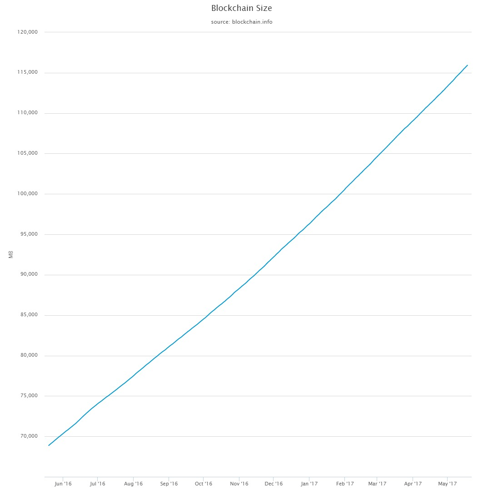
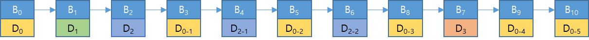
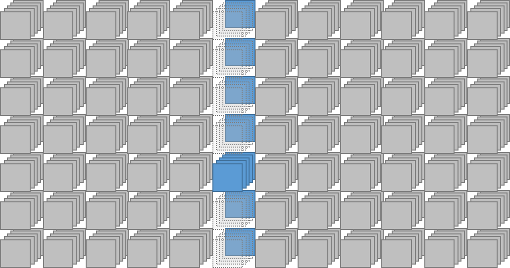
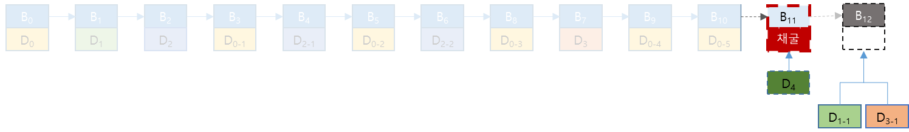

# X.Blockchain White Paper v1  
Yongseok Kwon  
April 24, 2018  
   
   
*Copyright © 2018 XBlock Systems CO., LTD.*  
*Without permission, anyone may use, reproduce or distribute any material in this white paper for non-commercial and educational use (i.e., other than for a fee or for commercial purposes) provided that the original source and the applicable copyright notice are cited.*  

**DISCLAIMER:** This X.Blockchain Technical White Paper is for information purposes only. XBlock Systems does not guarantee the accuracy of or the conclusions reached in this white paper, and this white paper is provided “as is”. block.one does not make and expressly disclaims all representations and warranties, express, implied, statutory or otherwise, whatsoever, including, but not limited to: (i) warranties of merchantability, fitness for a particular purpose, suitability, usage, title or noninfringement; (ii) that the contents of this white paper are free from error; and (iii) that such contents will not infringe third-party rights. block.one and its affiliates shall have no liability for damages of any kind arising out of the use, reference to, or reliance on this white paper or any of the content contained herein, even if advised of the possibility of such damages. In no event will block.one or its affiliates be liable to any person or entity for any damages, losses, liabilities, costs or expenses of any kind, whether direct or indirect, consequential, compensatory, incidental, actual, exemplary, punitive or special for the use of, reference to, or reliance on this white paper or any of the content contained herein, including, without limitation, any loss of business, revenues, profits, data, use, goodwill or other intangible losses.  
 
 
**Abstract:** Bitcoin의 등장과 이를 이용한 거래의 급증은, 블록체인 기술이 거래 원장으로서 신뢰 할 수 있을 만큼 충분히 안전하다는 것을 증명하였다. 블록체인 기술이 주목 받게 된 주된 이유는, 기존 방식과 달리 신뢰성 확보 문제에 있어서 제3의 신뢰기관 (Trusted Third Party, TTP) 을 제거 하였다는 것과, 모든 거래 내역이 네트워크에 참여하는 모든 참여자들에게 분산 저장됨으로 거래 내용에 대한 조작이 사실상 불가능 하도록 만들었다는 점이다.  
블록체인 기술에서 가장 중요한 핵심 개념은 ‘Decentralization (탈 중앙화)’ 과 ‘Distributed Ledger (분산원장)’ 개념이다. 기존 방식은, 모든 거래가 하나의 집중화된 중앙 서버에 기록 되고, 해당 거래의 신뢰는 이 중앙서버 (제3의 신뢰기관) 에 의하여 ‘보증 되는’ 방식 이였다. 그러나 블록체인 상에서 발생한 거래는 네트워크에 참여하는 모든 참여자들에게 전달되어 ‘검증’, ‘합의’되고, ‘블록’ 단위로 묶여 순차적(선형적)으로 연결된다.  
모든 거래 내역이 기록 되는 블록체인의 크기는 누적 거래 건수가 증가 할수록, 즉 시간이 지날수록 점차 커질 수 밖에 없으며, 이는 네트워크의 모든 참여자가 전체 블록체인을 저장 관리 하는 것이 사실상 불가능해 지는 시점이 언젠가 도래함을 의미한다. 즉 블록체인 전체를 저장 관리 할 수 있을 만큼의 성능을 갖춘 시스템(노드)는 점차 그 수가 줄어 상대적으로 소수의 노드 집단을 이루게 될 가능성이 크다. 그리고 이 것은 또 다른 형태의 중앙 집중화의 결과를 가져올 것이다. 상대적으로 소수의 노드 집단이 전체 블록체인을 관리 하게 되는 상황에서 거래의 신뢰성은 이 소수의 노드 집단에 의존할 수 밖에 없게 된다. 즉, 블록체인의 근본 개념인 ‘탈 중앙화’ 가 심각히 훼손 될 수 있음을 의미한다.  
**본 문서는 특별히 전자문서의 보호를 위한 블록체인 기술 응용에 있어서,블록체인 연결구조를 기존의 선형적인 구조에서 다차원 구조로 변형한 X.Blockchain 을 제안 함으로서 전체 블록체인 크기 문제와 그로 인한 노드 집중화 문제에 대한 해결책을 모색 하고자 한다.**

 

<!-- MarkdownTOC depth=4 autolink=true bracket=round list_bullets="-*+" -->

- [Problems](#problems)
- [Blockchain Structure](#blockchain-structure)
  * [Multi-Dimensional Blockchain](#multi-dimensional-blockchain)
  * [Joint Block](#join-block)
- [Consensus Algorithm](#consensus-algorithm)
  * [PBFT](#pbft)
  * [DPOS](#dpos)
  * [PBFT\+DPOS](#pbftdpos)
- [Accounts](#accounts)
- [Coin Model](#coin-model)
- [Inter Sub-chain Communication](#inter-sub-chain-communication)
- [Roadmap](#roadmap)

## Problems

블록체인의 크기는 시간이 지날수록 거래의 누적 건수에 비례하여 지속적으로 증가할 수 밖에 없다. 블록체인 네트워크에 참여하는 모든 노드에 원장이 분산 저장 관리 되고, 이를 통해 제3의 신뢰기관 없이 거래에 대한 신뢰 확보가 가능하다는 블록체인 근본 개념에 충실하고자 할 때, 계속 증가되는 블록체인의 크기 문제는 거래 검증을 위한 노드의 참여에 있어서 한계 상황을 발생 시키게 된다. 즉 거대해진 블록체인을 저장 관리하는 완전노드[[1]](#ref-1)로서 참여하기 위해서는 저장공간 확보와 같은 일정한 수준 이상의 성능이 요구된다. 이 성능 수준은 블록체인의 크기에 비례하여 지속적으로 상향 조정될 것이므로 참여 노드의 수적 감소는 불가피하게 되고 이는 다시 또 다른 형태의 ‘중앙 집중화’ 의 원인이 것이다[[2]](#_ftn2). 2017년 5월 현재 Bitcoin의 거래를 포함한 전체 블록체인 크기는 이미 115G[[3]](#_ftn3)를 넘어섰고, Ethereum 의 블록체인 역시 최근 20G를 넘어섰다.

Figure 1. Bitcoin’s full blockchain size

또한 Bitcoin 기준으로 현재 전세계 적으로 존재하는 완전 노드의 수는 약 5,000 \~ 7,000 개 정도의 수준으로 집계되고 있다.

반면에 일정 수준에 미치지 못하는 수많은 사용자 클라이언트 (모바일 디바이스 포함) 는 완전 노드로 서 참여를 제한 받게 된다. 이로 인하여 거래에 대한 신뢰 여부를 사용자 클라이언트 스스로 (제3의 신뢰기관 없이) 판단하지 못하고 상대적으로 소수인 이 완전 노드 집단에 ‘의뢰’ 해야 만 하며, 그 결과를 일방적으로 ‘수용’ 해야 한다. 여기서 소수의 완전 노드 집단은 ‘제3의 신뢰기관’ 처럼 작동한다.

이런 ‘완전 노드의 집중화’ 문제의 배경에는 앞서 언급한 바와 같이 거대해진 전체 블록체인의 저장과 블록 생성(채굴) 시 요구되는 높은 computing power가 원인으로 자리 잡고 있다. 여기서 다시 전체 블록체인의 저장이 요구되는 이유는, 블록체인의 구조가 선형적인 연결 구조로 이루어져 있기 때문에 정작 필요한 블록들만 따로 떼어내는 것이 무의미 하기 때문이다. 중간 중간 연결이 끊긴 블록의 집합은 어떤 신뢰도 확인해 줄 수 없기에 아무런 가치를 갖지 못한다.

이런 문제는 이중 지불 문제를 해결하기 위한 암호화 화폐의 ‘거래’ 에 있어서 일면 불가피한 측면이 있다. 얼마 만큼의 화폐가, 어느 계좌에서 어느 계좌로 이동함을 기록하는데 있어서 어떠한 제한 또는 분류가 불가능하다. 화폐의 ‘양’ 또는 화폐의 이동에 사용되는 ‘계좌’를 기준으로 거래를 분류할 수 없다. 모든 거래는 동일한 의의를 지니고, 동일한 의의를 갖는 모든 거래는 어떠한 기준으로도 분류될 수 없기에, 이러한 성격의 기록을 다루는데 있어서 선형적인 구조를 탈피하는 것은 사실상 불가능해 보인다.

반면에 ‘전자문서’의 경우, 암호화 화폐의 그것과는 달리 문서에 대한 다양한 기록들이 모두 해당 ‘문서’를 중심으로 이루어지게 된다. 문서에 대한 생성, 수정, 전송, 열람, 폐기 등 모든 기록은 해당 ‘문서’가 대상이다.

이는 문서 자체와 그와 관련된 기록이 바로 그 ‘문서’를 기준으로 분류 될 수 있음을 의미하며, 이는 블록체인상의 체인이 하나의 선형적인 구조가 아닌 다수의 체인으로 분류될 수 있음을 의미한다.

 

 

 

 
## Blockchain Structure
 
 
X.Blockchain 은, 앞서 언급한 전자문서의 특성을 반영하여, 문서에 대한 모든 기록(Transaction) 을 하나의 선형적인 구조로 연결하지 않고 ‘문서’ 또는 그 에 준하는 어떤 ‘기준’ 으로 분류한다. 그리고 이 기준에 따라 복수의 체인을 구성 함으로서 다차원 형태의 블록체인을 제안한다.

예를 들어 ‘문서’를 기준으로 하였을 때, 각 문서의 ‘최초 생성’ 은 기존 블록체인과 동일한 선형적인 구조의 블록체인(main-chain) 에 기록된다. 그러나 이미 main-chain에 기록된 특정 문서에 대하여 발생한 변경 등의 추가 기록(Transaction)은, main-chain이 아닌 main-chain 상의 해당 블록을 genesis block[[4]](#_ftn4)으로 하는 또 다른 블록체인인 sub-chain상에 기록 된다.

 

 

Figure 2. X.Blockchain

 

 

위 그림은 2차원 구조로 구성된 X.Blockchain 의 모습이다. 앞서 언급한 ‘문서’를 main-chain의 기준으로 잡았을 때, main-chain 을 구성하는 각각의 블록(B00 \~ Bn0)은 모두 신규 문서의 생성 기록을 포함하며, 동시에 각 sub-chain의 genesis block 이 될 수 있다. 예를 들어 B20 에 생성이 기록된 전자 문서 E20 에 대한 최초 수정이 발생하였다면 이는 main-chain 상의 다음 블록인 B30이 아닌, B20 을 genesis block 으로 하는 sub-chain 상의 B21에 기록 된다.

 

 

Figure 3. 선형적인 블록체인

 

 

선형적인 블록체인 구조에서는 동일한 문서라 할 지라도 해당 문서의 변경 등의 추가 기록은 블록체인의 추가 블록을 필요로 한다.

위 그림은 문서 D0 \~ D3 가 블록체인에 추가된 상황을 선형적으로 구성한 예이다. 이 예에서 문서 Dn은 생성, Dn-m 은 문서 Dn에 발생한 변경, 전송 등의 추가 기록을 의미한다. 문서 D0 의 경우 생성을 포함하여 총 6개의 기록 (\~ D0-5)이 발생하였고, 문서 D2의 경우 총 3번의 기록 (\~ D2-2) 이 발생하였다.

위와 같은 선형적인 블록체인에서 모든 클라이언트는 특정 문서의 신뢰를 스스로 검증하기 위해서 전체 블록 모두를 확보하여 저장하여야 한다. 즉 문서 D2만 필요한 클라이언트라 할지라도 사실상 불필요한 D0, D1, D3,에 대한 블록과 D0의 추가 기록을 담은 블록 D0-1 ~ D0-5까지 총 11개의 블록이 필요하다.

 

그러나 동일한 상황을 X.Blockchain 으로 구성하게 되면 다음과 같아진다.

 

 

 

Figure 4. X.Blockchain

 

 

위 그림에서 B00\\ \~B30 은 main-chain 을 구성하고, B00와 B20를 genesis block으로 하는 각각의 sub-chain이 구성되어 있다. 이와 같은 다차원 구조의 블록체인에서는 모든 클라이언트가 전체 블록체인을 가질 필요가 없다. 앞서 예에서와 같이 문서 D2만 필요 하다면 전체 블록체인이 아닌 D2를 genesis block으로 하는 sub-chain 과 그 상위 main-chain만 보유하면 문서 D2 에 대한 신뢰여부를 스스로 판단 할 수 있다. 즉 main-chain 의 블록 B00\\ \~B30과 sub-chain의 블록 B21\\ \~B22로 구성된 총 6개의 블록정보를 보유하는 것으로 충분한 것이다.

 

여기서 Main-chain에 적용된 ‘분류 기준’이 반드시 ‘문서’가 되어야 하는 것은 아니다. 서비스의 구성에 따라 ‘부서’ 단위가 기준으로 적용될 수 도 있고, 또는 연관성을 갖는 문서의 집합이 분류 기준으로 적용될 수도 있다.

또한 상황에 따라서 sub-chain은 또 다른 sub-chain의 main-chain이 되도록 구성이 가능하다. 토지대장의 경우, 큰 범위의 ‘지역’을 main-chain의 기준으로 하고 그 보다 작은 단위인 시,군,구 단위를 1차 sub-chain으로, 그리고 토지 구분 단위를 2차 sub-chain으로 분류한다면 위 그림에서 보여지는 2차원 구조가 아닌 아래 그림과 같은 3차원 구조의 구성이 가능하다.

 

 

 

Figure 5. 3차원 구조의 X.Blockchain

 

 

X.Blockchain 상에서 새로운 블록 채굴을 담당하는 완전노드는 여전히 모든 블록에 대한 정보를 가져 한다. 그러나 채굴이 아닌 문서에 대한 신뢰 여부를 판단하는데 있어서 클라이언트 (사용자 기기) 는 전체 블록을 가져야 할 필요가 없다. 각각의 사용자는 검증이 필요한 문서가 포함된 sub-chain과 바로 상위 단계의 main-chain을 확보 하는 것으로 충분히 해당 문서에 대한 신뢰를 ‘제3의 신뢰기관’ 없이 검증할 수 있다. 여기서 완전 노드는 신뢰여부를 확인해 주는 제3의 신뢰기관이 아닌 ‘채굴’을 수행하는 역할을 할 뿐이다.

 

 

 

 

**Parallel Transaction Processing**

 

선형적인 블록체인 구조에서는 하나의 블록이 생성되는 동안 발생한 모든 거래(Transaction)가 다음 블록 채굴이 시작될 때까지 대기상태로 머물게 된다. 더욱이 하나의 Block 크기[[5]](#_ftn5)가 무한정 커지는 것이 허용되지 않는 만큼 경우에 따라서는 다음 블록이 아니라 그 다음 블록 채굴 때까지 대기해야 하는 경우도 충분히 발생 가능하다. 블록체인 네트워크에 배포된 transaction이 블록에 포함되어 확정 되기까지의 대기 시간은 ‘초당 Transaction 처리 수’ - TPS[[6]](#_ftn6)를 떨어뜨리게 되어 그 만큼 transaction의 처리는 지연 된다.

그러나 X.Blockchain 상에서는 각 sub-chain 별로 블록 채굴 작업의 동시 진행이 가능하다. 예를 들어 main-chain 상의 블록 Bn0 채굴 작업과 sub-chain 상의 블록 B2m 채굴 작업은 서로 동시에 진행될 수 있다. Bn0과 B2m는 서로 분리된 블록체인에 속하므로 상호 연결 관계를 갖지 않기 때문이다.

 

 

 

Figure 6. Transaction Processing - 선형구조 블록체인

 

 

위 그림은 앞서 제시된 예시 상황에서 D4가 신규 생성되고 뒤 이어 문서 D1과 D3에 대한 변경 기록이 발생하였을 경우를 가정한 그림이다. 선형적인 블록체인에서는 D1과 D3 변경 기록은, 진행중인 D4 신규 생성에 대한 채굴 작업이 진행되는 동안 대기상태에 머무르게 된다. D4 생성 블록 B11의 채굴 작업이 완료된 후, 다음 블록 B12에 대한 채굴이 시작될 때 D1과 D3에 대한 변경 사항은 블록 B12에 포함되어 채굴 작업이 완료되어 최종적으로 블록체인에 연결 될 때 비로소 블록체인에 기록이 완료된다.

 

 

 

Figure 7. Transaction Processing – X.Blockchain

 

그러나 다차원 구조의 X.Blockchain에서는 위 그림과 같이, 문서 D4 생성 블록 B40의 채굴이 완료될 때까지 문서 D1, D3의 변경 사항에 대한 블록 B11, B31의 채굴 작업이 대기 할 필요가 없다. 제시된 예에서 모든 신규 블록 B40, B11, B31에 대한 채굴 작업은 각각 독립적으로 동시 진행이 가능하다.

** **

 

 
 

**Effectiveness**

 

주민등록초본을 전자문서화 하고 블록체인 기술을 적용 하여 관리 하는 상황을 가정하였을 때, X.Blockchain 적용과 기존 블록체인 적용이 어떻게 다른가에 대하여 설명한다.

구성 인구 1명당 1개의 초본이 존재하고 이는 다시 1개의 블록을 구성한다고 가정하였으며, 해마다 이동 인구수 만큼 주민등록초본 갱신이 발생하고 이 역시 하나의 블록으로 기록됨을 가정하였다.

 

 

| | |2016년|
|---|---|---:|
|총이동|이동자수|7,378 명|
|    |이동률(%)|14.4%|
|    |전입신고건수|14.4%|
|    |이동률(%)|14.4%|
*[단위:천명, %, 천건], 출처:통계청 「국내인구이동통계」*
 

대한민국의 총인구는 국가통계포털([http://kosis.kr](http://kosis.kr)) 발표에 따르면 2015년말 기준 51,525,338명 이다. 인구 1명당 주민등록초본 1부가 존재하고 거주 지역을 이동 할 때 마다 이 초본은 갱신되어야 하며, 위 표의 데이터에 따르자면 2016년 한 해 동안 총 7,378,000번[[7]](#_ftn7)의 초본 갱신이 발생 되었음을 알 수 있다.

 

이를 선형적인 블록체인으로 구성한다면, 최초 블록체인은 전체 인구수 만큼의 블록으로 구성되고, 해마다 인동 인구수 만큼의 블록이 추가되어야 한다. 만약 2016년부터 적용한다면 2016년 말 기준으로 블록체인의 블록 수는 아래와 같다.

| $ 51,525,338 + 7,378,000 = 58,903,338 $ |
|---|

그리고 한 해 평균 7,000,000 명이 이동한다 가정 하였을 때, 해마다 7백만개의 블록이 추가된다. 여기에 한 블록당 80byte의 크기[[8]](#_ftn8)로 하여 10년 동안의 기록이 누적된 전체 블록체인 크기를 산출하면 아래와 같다.

| 블록체인의 크기 = $ (51,525,338 + 7,000,000 * 10) * 80 / 1024^3 = 9.1 G $|
|---|

 

 

즉 선형 구조의 블록체인의 경우, 10년동안의 누적 블록체인 크기 9.1G 와 향후 매년 변경 증가분 0.52 G 가 선형적으로 증가한다.

 

동일한 조건을 X.Blockchain에 적용하면, 전체 블록의 수와 크기는 동일하지만, 해마다 추가되는 변경 블록수가 main-chain에 선형적으로 연결되는 것이 아닌 sub-chain으로 구성 될 것이다. 즉 10년 동안의 변경분에 대한 70,000,000개의 블록은 51,525,338 개의 블록으로 구성된 main-chain의 sub-chain 으로 분산되어 구성될 것이다. 변경분의 블록이 main-chain의 sub-chain에 분산되는 정도를 단순 산술 평균으로 적용하면, main-chain의 블록 1개당 1개의 sub-chain을 갖고, sub-chain당 1.35개[[9]](#_ftn9) 의 블록을 갖게 된다. 이에 근거한 인구 1명당 블록체인의 크기는 아래와 같다.

| sub-chain의 평균크기  = $ (7,000,000 * 10 / 51,525,338) * 80 = 108.68 B $ |
|---|

| main-chain의 크기 = $ 51,525,338 * 80 / 1024^3 = 3.83 G $ |
|---|

 

선형 구조의 블록체인과는 달리 X.Blockchain 의 경우, 필요한 데이터에 대한 선별적 관리가 가능하다. 만약 어떤 이유에 의하여 특정 인구 1백만명에 대한 주민등록초본관리 등과 같은 서비스가 가능하다는 것이다. 이 경우 인구 1백만명의 10년동안의 주민등록초본 변경 이력에 대한 검증을 위해서 필요한 총 저장 용량은 다음과 같다.

| $ 3.83 + 108.68 * 1,000,000 / 1024^3 = 3.93 G $ |
|---|
 

향후 블록체인의 크기는 해마다 1백만명에 대한, 한해 평균 변경 블록 크기 만큼만 증가하게 된다.

이 장에서 가정한 상황에는 출생에 따른 main-chain의 증가와 사망, 혼인, 이혼및 기타 사유에 따른 sub-chain의 변경(증가)[[10]](#_ftn10)에 대해서는 고려하지 않았다. 때문에 실제로는 더 큰 전체 블록체인이 필요할 것이다. 또한 main-chain의 분류 기준이 반드시 인구 1명이 되어야 하는 것도 아니며, 하나의 블록에 반드시 하나의 문서(Transaction)만 포함되어야 하는 것도 아니다. 때문에 위 산출 값은 실재적 의미가 아닌, 선형 구조의 블록체인과 다차원 구조의 X.Blockchain 비교를 위한 상대적인 값으로서의 의미만을 갖는다.

 

다만, 위 예시는 주민등록초본 이라는 문서 1종에 대해서만 적용한 경우인데, 실제 다양한 공공문서가 동시에 적용될 수 있을 것이다. 추가되는 문서가 많을수록 선형적인 블록체인 대비 다차원 블록체인의 상대적 효율성은 급격히 커지게 된다. 만일 위 예시에 다른 공공기관 제증명 문서 1종이 추가되면, 그리고 문서 변경 이력 등과 같은 Transation이 주민등록초본과 비슷한 비율로 발생된다 가정하면, 선형적인 블록체인의 경우 문서 1종 추가시 약 2배의 블록이 추가적으로 필요해 진다. 그리고 또 다른 문서가 추가된다면 역시 마찬가지로 동일한 블록의 증가가 발생한다.

그러나 X.Blockchain의 경우, main-chain 의 크기에는 변화가 없으며, 추가된 문서 종류에 의한 블록 추가는 모두 sub-chain상에서만 이루어지게 되므로, 다차원 구조의 X.Blockchain의 상대적 효율성은 그만큼 높아지게 된다.

 

 

 

**Conclusion**

 

언급한 바와 같이 전체 블록체인의 크기는 달라지지 않는다. 다차원 구조의 X.Blockchain의 주요 차별성은 특정 기준에 따른 데이터(블록)의 선택적 관리가 가능 하다는 점에 있다. 그리고 사용자 클라이언트가 필요한 범위의 블록체인을 선택적으로, 직접 저장 관리 함으로서, 해당 범위 내에서 만큼은 문서에 대한 신뢰의 문제를 제3의 신뢰기관의 개입 없이 스스로 해결 할 수 있도록 하는 데 그 목적이 있다.

## Consensus Algorithm
#### PBFT
#### DPOS
#### PBFT\+DPOS

## Accounts

## Coin Model

## Inter Sub-chain Communication

## Roadmap
* * * * *

###### ref 1
완전 노드는 전체 블록체인을 저장하고 새로운 블록 채굴 작업을 진행하는 노드를 의미한다.

[[2]](#_ftnref2) 이 문제에 대한 해결책으로서 Bitcoin 에서는 SPV를 제안하고 있다. Transaction 데이터를 제외한 블록 헤더 정보만으로 거래 입증을 수행 함으로서 이에 필요한 리소스를 최소화 하는 방법이며 전자문서를 위한 블록체인 응용에서 이는 필수적으로 적용 된다. 암호화폐에서 transaction을 구성하는 것이 거래 내역 이라면, 전자문서 응용에서는 전자문서 데이터가 transaction의 주요 부분이 된다. 이 때 문서의 크기는 암호화폐의 거래 내역과는 비교할 수 없을 만큼 크기 때문에 블록체인에 문서 데이터 그 자체를 포함하지 않는다.

본 문서에서 특별한 언급이 없는 한 ‘블록체인 크기’는 ‘블록체인 헤더 크기’를 의미한다.

[[3]](#_ftnref3) 거래를 기술하는 모든 Transaction 데이터와 블록 헤더 정보를 포함하는 전체 블록체인 크기.

[[4]](#_ftnref4) 블록체인의 첫번째 블록.

[[5]](#_ftnref5) Bitcoin 에서 블록 크기는 1MB로 제한되고 있다. 블록 크기 제한은 블록이 포함할 수 있는 거래의 수를 제한 하게 되어 단위 시간당 처리되는 거래의 수 (Transaction Per Seconds - TPS) 를 떨어뜨린다. 현재 Bitcoin의 블록 크기를 확장하는 문제가 논의 중에 있으며 Bitcoin Classic 과 같은 일부 구현에서는 2MB의 블록크기를 사용하고 있기도 하지만 채굴자들의 지지를 받지 못하고 있다.

[[6]](#_ftnref6) 현재 Bitcoin의 TPS는 약 7 TPS 정도를 기록하고 있다.

[[7]](#_ftnref7) 국가통계포털의 발표 자료에 따르면 2016년 정확한 이동인구의 수는 7,378,383명이다.

[[8]](#_ftnref8) Bitcoin의 블록헤더 크기는 81 byte 이다.

[[9]](#_ftnref9) 인구 1명당 10년동안 평균 이동 수에 해당한다.

[[10]](#_ftnref10) sub-chain의 증가분이 클수록 다차원 구조 X.Blockchain의 효율성은 높아진다.
