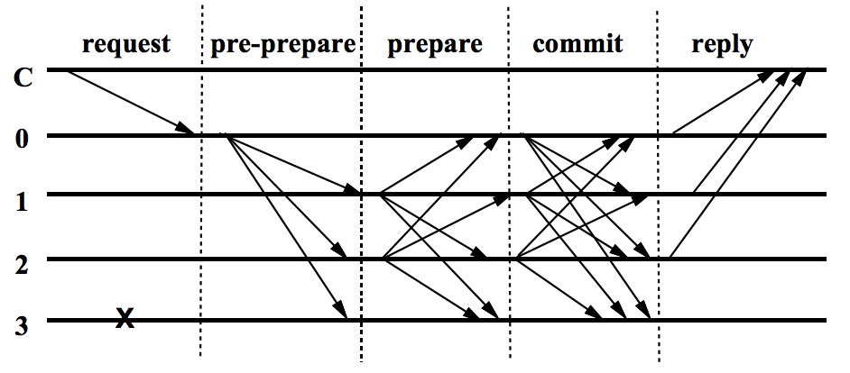
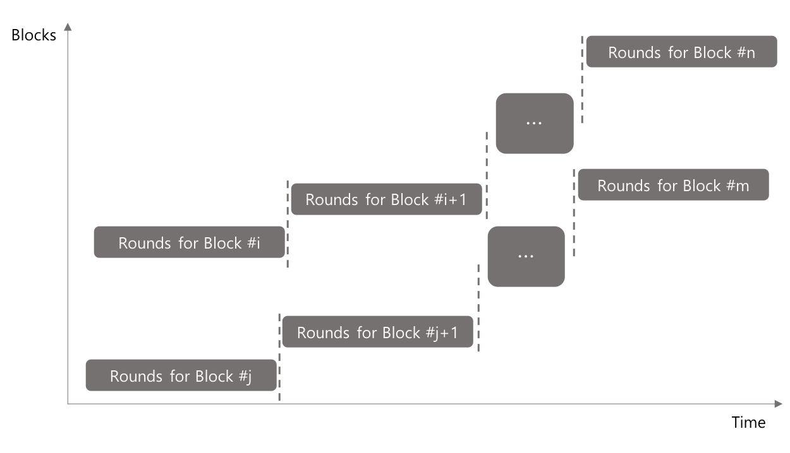
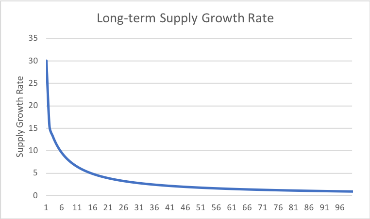
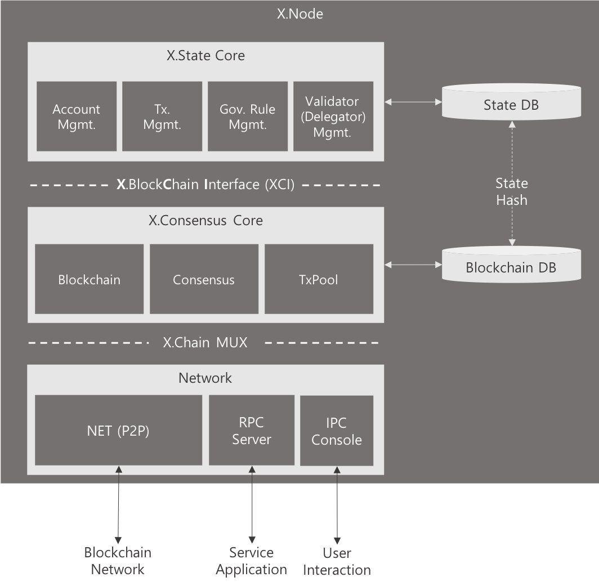
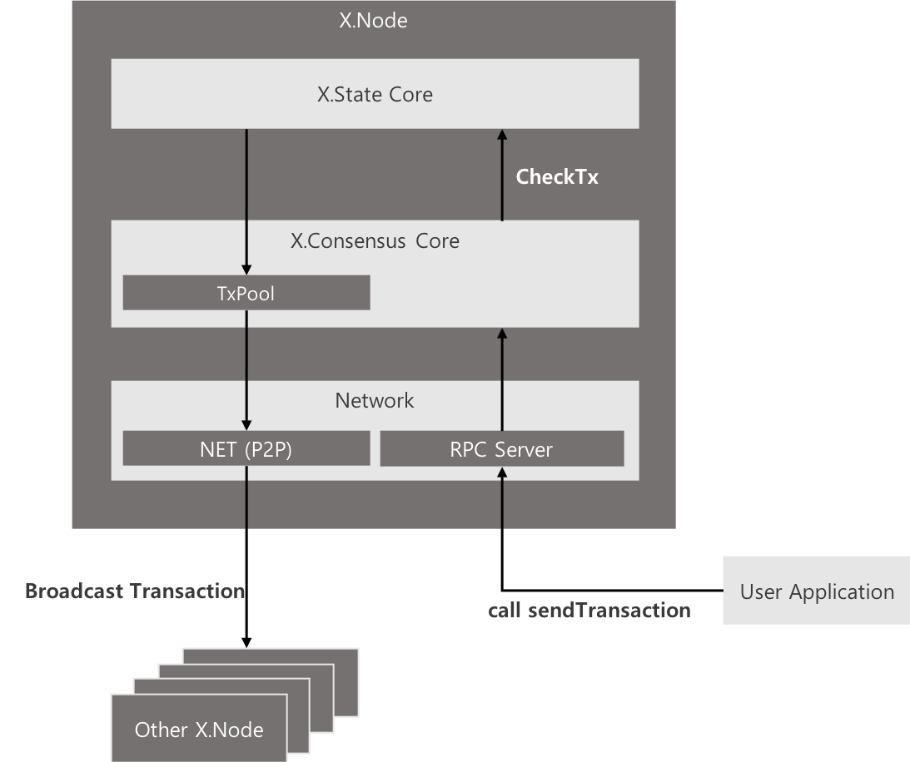
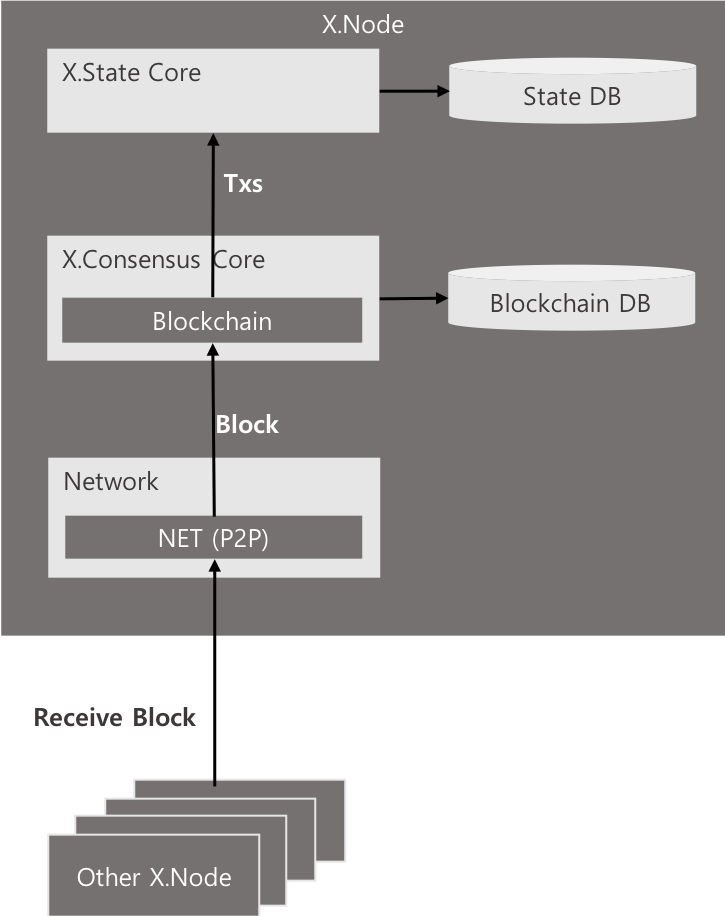
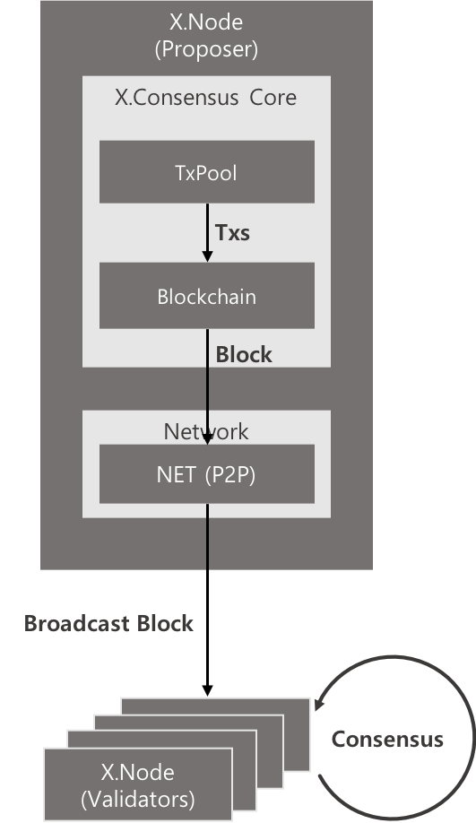
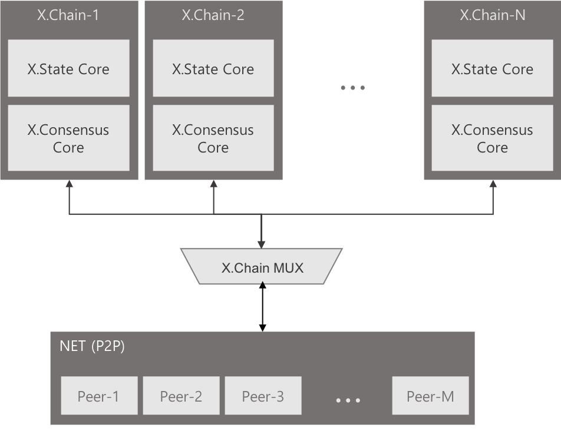
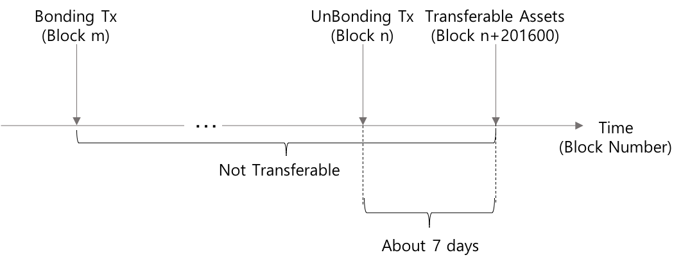
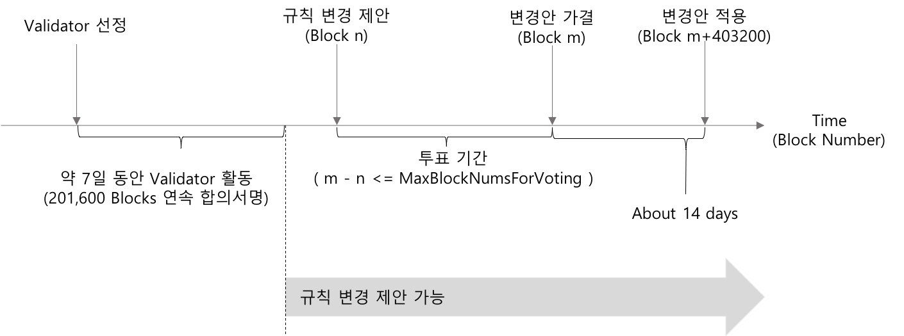

---
markdown:
    path: WhitePaper_ko-KR.md
    ignore_from_front_matter: false
    absolute_image_path: false
---  
  
# X.Blockchain Technical White Paper V1
  
Yongseok Kwon  
May 21, 2018
  
*Copyright © 2018 XBLOCK SYSTEMS CO., LTD.*  
*Without permission, anyone may use, reproduce or distribute any material in this white paper for non-commercial and educational use (i.e., other than for a fee or for commercial purposes) provided that the original source and the applicable copyright notice are cited.*  
  
**DISCLAIMER:** This X.Blockchain Technical White Paper is for information purposes only. XBLOCK SYSTEMS does not guarantee the accuracy of or the conclusions reached in this white paper, and this white paper is provided "as is". XBLOCK SYSTEMS does not make and expressly disclaims all representations and warranties, express, implied, statutory or otherwise, whatsoever, including, but not limited to: (i) warranties of merchantability, fitness for a particular purpose, suitability, usage, title or noninfringement; (ii) that the contents of this white paper are free from error; and (iii) that such contents will not infringe third-party rights. XBLOCK SYSTEMS and its affiliates shall have no liability for damages of any kind arising out of the use, reference to, or reliance on this white paper or any of the content contained herein, even if advised of the possibility of such damages. In no event will XBLOCK SYSTEMS or its affiliates be liable to any person or entity for any damages, losses, liabilities, costs or expenses of any kind, whether direct or indirect, consequential, compensatory, incidental, actual, exemplary, punitive or special for the use of, reference to, or reliance on this white paper or any of the content contained herein, including, without limitation, any loss of business, revenues, profits, data, use, goodwill or other intangible losses.  
  
<br />
  
**Abstract:** Bitcoin의 등장과 이를 이용한 거래의 급증은, 블록체인 기술이 거래 원장으로써 신뢰 할 수 있을 만큼 충분히 안전하다는 것을 증명하였다. 블록체인 기술이 주목 받게 된 주된 이유는, 기존 방식과 달리 신뢰성 확보 문제에 있어서 제3의 신뢰기관 (Trusted Third Party, TTP) 을 제거 하였다는 것과, 모든 거래 내역이 네트워크에 참여하는 모든 참여자들에게 분산 저장됨으로 거래 내용에 대한 조작이 사실상 불가능 하도록 만들었다는 점이다.  
블록체인 기술에서 가장 중요한 핵심 개념은 'Decentralization (탈중앙화)' 과 'Distributed Ledger (분산원장)' 개념이다. 기존 방식은, 모든 거래가 하나의 집중화된 중앙 서버에 기록 되고, 해당 거래의 신뢰는 이 중앙서버 (제3의 신뢰기관) 에 의하여 '보증 되는' 방식 이였다. 그러나 블록체인 상에서 발생한 거래는 네트워크에 참여하는 모든 참여자들에게 전달되어 '검증', '합의'되고, '블록' 단위로 묶여 순차적(선형적)으로 연결된다.  
모든 거래 내역이 기록 되는 블록체인의 크기는 누적 거래 건수가 증가 할수록, 즉 시간이 지날수록 점차 커질 수 밖에 없으며, 이는 네트워크의 모든 참여자가 전체 블록체인을 저장 관리 하는 것이 사실상 불가능해 지는 시점이 언젠가 도래함을 의미한다. 즉 블록체인 전체를 저장 관리 할 수 있을 만큼의 성능을 갖춘 시스템(노드)는 점차 그 수가 줄어 상대적으로 소수의 노드 집단을 이루게 될 가능성이 크다. 그리고 이 것은 또 다른 형태의 중앙 집중화의 결과를 가져올 것이다. 상대적으로 소수의 노드 집단이 전체 블록체인을 관리 하게 되는 상황에서 거래의 신뢰성은 이 소수의 노드 집단에 의존할 수 밖에 없게 된다. 즉, 블록체인의 근본 개념인 '탈중앙화' 가 심각히 훼손 될 수 있음을 의미한다.  
**본 문서는 블록체인 기술 응용에 있어서, 블록체인 연결구조를 기존의 선형적인 구조에서 다차원 구조로 변형한 X.Blockchain 을 제안 함으로써 전체 블록체인 크기 문제와 그로 인한 노드 집중화 문제에 대한 해결책을 모색 하고자 한다.**
  
<br />
  
  
  
## Table of Contrents
  
  
- [Problems](#problems )
- [Background](#background )
- [What is X.Blockchain](#what-is-xblockchain )
  + [Overview](#overview )
  + [Components](#components )
    + [X.Chain](#xchain )
    + [X.Block](#xblock )
    + [X.Transaction](#xtransaction )
    + [Assetful X.Chain](#assetful-xchain )
    + [Assetless X.Chain](#assetless-xchain )
    + [MainChain](#mainchain )
    + [SubChain](#subchain )
  + [Consensus Algorithm](#consensus-algorithm )
    + [PBFT (Practical Byzantine Fault Tolerance)](#pbft-practical-byzantine-fault-tolerance )
    + [Validators and Delegating](#validators-and-delegating )
    + [Proof of Forkability](#proof-of-forkability )
  + [Accounts & States](#accounts--states )
- [Asset Model](#asset-model )
  + [Currency & Issurance](#currency--issurance )
  + [Incentives](#incentives )
  + [Unit of Assets](#unit-of-assets ) <sup><span style="color:orangered;font-size:8pt;">New</span></sup>
- [System Architecture](#system-architecture ) <sup><span style="color:orangered;font-size:8pt;;">New</span></sup>
  + [X.Node](#xnode ) <sup><span style="color:orangered;font-size:8pt;;">New</span></sup>
  + [X.State Core](#xstate-core ) <sup><span style="color:orangered;font-size:8pt;;">New</span></sup>
  + [X.Consensus Core](#xconsensus-core ) <sup><span style="color:orangered;font-size:8pt;;">New</span></sup>
  + [X.Chain MUX](#xchain-mux ) <sup><span style="color:orangered;font-size:8pt;;">New</span></sup>
  + [RPC Server](#rpc-server ) <sup><span style="color:orangered;font-size:8pt;;">New</span></sup>
  + [Validators & Delegators](#validators--delegators ) <sup><span style="color:orangered;font-size:8pt;;">New</span></sup>
    + [Bonding Assets](#bonding-assets ) <sup><span style="color:orangered;font-size:8pt;;">New</span></sup>
    + [Unbonding Assets](#unbonding-assets ) <sup><span style="color:orangered;font-size:8pt;;">New</span></sup>
  + [Governance Rules](#governance-rules ) <sup><span style="color:orangered;font-size:8pt;;">New</span></sup>
    + [Proposal](#proposal ) <sup><span style="color:orangered;font-size:8pt;;">New</span></sup>
    + [Vote](#vote ) <sup><span style="color:orangered;font-size:8pt;;">New</span></sup>
    + [Apply](#apply ) <sup><span style="color:orangered;font-size:8pt;;">New</span></sup>
- [RPC Interfaces](#rpc-interfaces ) <sup><span style="color:orangered;font-size:8pt;;">New</span></sup>
- [Data Structure](#data-structure ) <sup><span style="color:orangered;font-size:8pt;;">New</span></sup>
    + [Block](#block ) <sup><span style="color:orangered;font-size:8pt;;">New</span></sup>
    + [Transactions](#transactions ) <sup><span style="color:orangered;font-size:8pt;;">New</span></sup>
    + [Account](#Account ) <sup><span style="color:orangered;font-size:8pt;;">New</span></sup>
- [Command Line Options](#command-line-options ) <sup><span style="color:orangered;font-size:8pt;;">New</span></sup>
- [Use Cases](#use-cases )
  
<br /><br />
  
## Problems
  
  
블록체인의 크기는 시간이 지날수록 거래의 누적 건수에 비례하여 지속적으로 증가할 수 밖에 없다. 블록체인 네트워크에 참여하는 모든 노드에 원장이 분산 저장 관리 되고, 이를 통해 제3의 신뢰기관 없이 거래에 대한 신뢰 확보가 가능하다는 블록체인 근본 개념에 충실하고자 할 때, 계속 증가되는 블록체인의 크기 문제는 거래 검증을 위한 노드의 참여에 있어서 한계 상황을 발생 시키게 된다. 즉 거대해진 블록체인을 저장 관리하는 완전노드<sup id="a1">[1](#f1 )</sup>  로서 참여하기 위해서는 저장공간 확보와 같은 일정한 수준 이상의 성능이 요구된다. 이 성능 수준은 블록체인의 크기에 비례하여 지속적으로 상향 조정될 것이므로 참여 노드의 수적 감소는 불가피하게 되고 이는 결국 또 다른 '중앙 집중화' 형태로 귀결 될 수 밖에 없게 된다<sup id="a2">[2](#f2 )</sup>. 2018년 5월 현재 Bitcoin의 전체 블록체인 데이터 크기<sup id="a3">[3](#f3 )</sup> 는 이미 200G 에 육박하고 있고, Ethereum 의 블록체인 데이터는 최근 600G를 넘어섰다.
  
<br />
<p align="center">
<br />
<i>Bitcoin & Ethtereum blockchain size - 출처: <a href="http://bc.daniel.net.nz/">http://bc.daniel.net.nz/</a></i>
</p>
  
<br />
  
<p align="center">
<br />
<i>Bitcoin & Ethtereum CPU usage - 출처: <a href="http://bc.daniel.net.nz/">http://bc.daniel.net.nz/</a></i>
</p>
<br />
  
이러한 일정 수준의 '자격조건'은, 절대 다수의 사용자 클라이언트 (모바일 디바이스 포함)로 하여금 블록체인 네트워크에 완전 노드로서 참여 하는 것을 사실상 불가능하게 만든다. 결과적으로 사용자 클라이언트는 거래에 대한 신뢰 여부를 스스로 (제3의 신뢰기관 없이) 판단하지 못하고, 상대적으로 소수인 완전 노드 집단에 '의뢰' 해야 만 하며, 그 결과를 일방적으로 '수용' 해야 한다. 여기서 소수의 완전 노드 집단은 '제3의 신뢰기관' 처럼 작동한다.  
이런 '완전 노드의 집중화' 문제의 배경에는 앞서 언급한 바와 같이 거대해진 전체 블록체인의 저장과 블록 생성(채굴) 시 요구되는 높은 computing power가 원인으로 자리 잡고 있다. 여기서 다시 전체 블록체인의 저장이 요구되는 이유는, 블록체인의 구조가 선형적인 연결 구조로 이루어져 있기 때문에 정작 필요한 블록들만 따로 떼어내는 것이 불가능 하기 때문이다. 중간 연결 관계가 끊긴 블록의 집합은 어떤 신뢰도 확인해 줄 수 없기에 아무런 가치를 갖지 못한다.  
이러한 블록체인의 특성은, 그 것이 갖는 뛰어난 혁신성에도 불구하고, 여러가지 비효율을 감수하도록 한다. 예를 들어 어느 회사에서 내부 부서 활동 기록을 기록하여 관리하고자 어떤 공개 블록체인(Public Blockchain)을 활용하기로 결정하였다고 가정하자. 이 회사에서 운영하는 블록체인 노드에는 자신의 기록과는 상관없는, 전세계적으로 이 공개 블록체인 상에 발생되고 있는 수 많은 트랜잭션 전체가 저장되어야 한다. 그리고 이 전체 블록체인 데이터는 아마도(거의 확실하게) 이 회사가 발생시킨 트랜잭션보다 수 백, 수천 만배는 더 클 것이다. 이 회사 입장에서 보자면 불필요한, 그러나 자신이 발생시킨 데이터와는 비교도 안될 만큼의 큰 데이터를 저장 관리 해야 하는 것이다.  
이러한 문제를 해결하기 위해 비공개 블록체인(Private Blockchain) 활용을 검토해 볼 수 있다. 물론 비공개 블록체인 역시 중요한 그리고 충분한 가치를 갖지만, 앞서 제기한 문제 이상으로 중앙 집중화된 구조를 갖는다는 점에서 우리가 바라는 해결책은 아니다.  
  
우리는 공개 블록체인과 같은 수준의 분산 구조를 유지하면서, 하나의 단일한 블록체인 네트워크상에 제출(발생) 되는 모든 트랜잭션들을 유의미한 관계를 갖는 트랜잭션들의 집합을 구성하고, 각각의 집합에 포함된 트랜잭션들로 이루어진 독립적이고 개별적인 블록체인들의 연결 구조를 제안한다. 이로서 하나의 단일한 공개 블록체인 네트워크에 참여하는 모든 노드가 반드시 전체 블록을 관리해야 하는 제약 사항에서 벗어나, 선택적인 블록체인 구성 및 관리가 가능한 구조와 방법을 제시하고자 한다.  
  
X.Blockchain 은, 발생되는 모든 기록(Transaction) 을 반드시 하나의 선형적인 구조로 구성하는 것을 강제 하지 않는다. 이는 트랜잭션에 따라 의도적으로 분기(fork) 를 허용 함으로써, 유의미한 관계를 갖는 Transaction 들로 이루어진 개별적인 블록체인 구성이 가능함을 의미한다.
예를 들어 '문서'를 기준으로 하였을 때, 각 문서의 '최초 생성' 은 기존 블록체인과 동일한 선형적인 구조의 블록체인(MainChain) 에 기록된다. 그러나 이미 MainChain에 기록된 특정 문서에 대하여 발생한 변경 등의 추가 기록(Transaction)은, MainChain이 아닌 MainChain 상의 해당 블록을 genesis block 으로 하는 또 다른 블록체인인 SubChain상에 기록 된다.  
다시 앞서 제시한 예를 들자면, 공개 블록체인 상에 내부 활동 기록을 관리하고자 하는 회사에서는 이미 존재하는 MainChain 에 자신의 블록체인의 Gennesis Block 으로 사용될 블록을 생성하고, 그 블록을 시작으로 하는 별도의 SubChain을 구성하여 여기에 회사 내부 활동 기록을 저장 관리 한다. 이로서 회사는 다른 목적을 갖는 트랜잭션 및 블록의 저장을 최소화 할 수 있다.  
  
<br /><br />
  
## Background
  
  
기존의 블록체인에서 분기(fork)는 블록에 기록된 데이터의 일관성을 훼손 시킨다. 분기되어 같은 블록 높이(block height)를 갖는 복수의 블록이 존재한다는 것은 특정 시점에 단일한 대상이 복수의 서로 다른 상태값을 동시에 갖는다는 것을 의미하며 이것은 그 자체로 모순이다. 즉 'A 계좌 잔고가 현재 2백만원이면서 동시에 3백만원이다' 라고 정의하는 것과 다름 아니다. A계좌에서 250만원을 인출했다고 하자. 인출 후 A 계좌의 잔액은 얼마인가? 그 전에 인출이 가능한가?  
이러한 문제를 피하기 위해서는 동일한 대상의 상태를 변경하는 사건들은 반드시 순차적으로 처리되어야 한다. 상태를 변경시키는 임의의 사건에 대한 처리가 완료되어 상태 변경이 확정된 이후 또 다른 사건에 대한 처리 결과가 앞서 변경된 상태에 추가적으로 반영되어야 함을 의미한다. 예를 들어 A의 상태를 S<sub>A</sub>, 이를 변경하는 사건들의 집합을 T<sub>A</sub>라 하고, 개별 사건 t () 에 의하여 변경된 A의 상태를 S<sub>A,t</sub> 라 하자. 복수의 사건 t1 과 t2 를 가정하였을 때, 사건 t1 의 처리가 완료되어 A의 상태가 S<sub>A,t1</sub> 으로 확정된 이후에 사건 t2 의 처리가 진행되어야 한다. t2가 선행하여 발생하는 경우도 마찬가지 이다. t2 의 처리 결과로서 A의 상태가 S<sub>A,t2</sub>로 확정된 상황에서 t1 처리가 진행되어야 한다.
  
<br />
<p align="center"></p>  
  
<br />
  
이것을 블록 구조로 표현하면 다음과 같다.
  
<br />
  
<p align="center">

<br /> or <br /><br />

</p>
<br />
  
그러나 S<sub>A</sub> 에 대하여 t1 의 처리가 완료되기 이전에 t2 에 대한 처리가 동시에 이루어진다면, 사건 t1 이 처리되는 시점의 A의 이전 상태를 S<sub>A,t0</sub> 라 할 때, 사건 t2 가 처리되는 시점의 A의 이전 상태 역시 S<sub>A,t0</sub> 가 되므로, S<sub>A,t0</sub>는 S<sub>A,t1</sub> 와 S<sub>A,t2</sub> 두가지 상태로 분기된다.
  
<br />
<p align="center"></p>  
  
  
<br />
<p align="center">

</p>
<br />
  
이는 전형적인 이중 지불 문제가 발생한 경우에 해당된다. 이 문제를 해결하기 위해서는 특정 시점(block height = #n-1) 에서 S<sub>A</sub>는 오직 하나로 강제 되어야 한다. 즉 S<sub>A</sub>의 최종 상태는 S<sub>A,t1</sub> 과 S<sub>A,t2</sub> 둘 중 어느 하나로 결정되어져야 하며, 결과적으로 사건 t1, t2 중 어느 하나는 취소(무효화) 되어야 함을 의미한다.
  
<br />
<p align="center">

</p>
<br />
  
이는 동일한 대상의 상태 변경을 일으키는 모든 사건은 동시성을 가질 수 없으며 반드시 순차적인 처리가 강제 되어야 한다는 것을 설명해 준다.
  
암호 화폐 거래의 경우, 사건(거래)은 특정 계정의 상태(잔고) 변경만이 아니라, 송금 계정과 수취 계정를 포함하는 복수의 계정 상태를 변경한다. 동시에 하나의 계정은 자신을 제외한 다른 모든 계정과 잠재적으로 거래가 가능 해야 한다. 거래 t1: A -> B 와 거래 t2: A -> C 가 있을 때, t1 은 A와 B의 상태(잔고)를 동시에 변경한다. 따라서 A와 B의 상태를 변경하는 다른 사건들과 동일한 사건 집합에 속하게 된다. 동시에 t2 역시 A 와 C의 상태를 동시에 변경하므로 A와 C를 변경하는 다른 모든 사건들과 동일한 사건 집합에 속하게 된다. 결과적으로 t1, t2를 포함하여 A, B, C 의 상태를 변경하는 사건은 모두 하나의 동일한 사건 집합에 속하게된다. 만일 거래 t3: D -> E 를 가정 한다면, t3 는 A, B 의 상태 변경과는 관계가 없음으로 별개의 사건 집합으로 분류 되는 것도 가능 할 것이다. 그러나, D 또는 E 는 A, B, C 와의 거래도 가능할 것이므로, 이러한 잠재적으로 발생 가능한 사건들로 인해 D의 상태가 A의 상태 변경과 동기화 되어야 할 가능성에 대하여 고려 되어야 한다(E 역시 마찬 가지 이다). D의 상태 변경이 사건 집합 T<sub>i</sub> 에 속하다가 다른 계정과 새로운 거래로 인하여 또 다른 사건 집합 T<sub>j</sub> 에 속하게 된다면 결국 T<sub>i</sub> 과 T<sub>j</sub> 는 순차성이 보장 되어야 하는 더 큰 사건 집합의 부분집합으로 결국 포함 되어야 할 것이다. 결과적으로 A, B, C, D, E 에 대한 모든 사건들은 단일한 하나의 사건 집합으로 구성 되는 것이 편리하다. 결국 여기서 관리 되어야 할 상태란 각 개별 계정이 상태가 아닌, 불특정 다수의 계정간 거래가 기록되는 단일한 '거래 내역 원장'의 상태인 것이다.
  
<br /><br />
  
## What is X.Blockchain
  
### Overview
  
앞서 기존의 블록체인이 선형적인 구조로 구성 될 수 밖에 없었던 이유를 이중 지불 문제를 중심으로 하여 살펴 보았다. 동일한 대상의 상태 변경을 일으키는 모든 사건은 동시성을 가질 수 없으며 반드시 순차적인 처리가 강제 되어야 한다는 것이 그것이다.  
그러나 서로 다른 대상의 상태를 변경하는 사건들의 경우, '반드시' 순차적으로 처리 되어야 할 필요가 없다. 예를 들어 각각 독립적으로 존재하는 '문서'를 대상으로 할 경우, 특정 문서의 상태 변경이 다른 문서의 상태 변경과 의미있는 관계를 갖지 않는다<sup id="a4">[4](#f4 )</sup>. 여기서 개별 사건(각 문서 변경)은 오직 하나의 대상 (여기서는 특정 문서) 에 대해서만 적용되기 때문에, 사건들은 서로에 대하여 동기화 될 필요가 없다. 다시 말해서 다수의 문서들의 상태가 동시에 변경 되어도 앞서 언급한 이중 지불 문제와 같은 모순은 발생되지 않을 것이다. 사건의 순차적인 처리는 동일한 대상의 상태 변환을 일으키는 사건들 사이 에서만 의미를 갖기 때문이다.
  
이것은 복수의 서로 다른 대상(문서) A, B, C ... 에 대한 각각의 사건 집합을 T<sub>A</sub>, T<sub>B</sub>, T<sub>C</sub>, ... 이라 할 때, 각 사건 집합은 하나의 독립적인 선형 구조로 구성 되는 것이 가능함을 의미한다. 즉, 서로 다른 사건 집합 T<sub>A</sub> 와 T<sub>B</sub> 에 속하는 사건 t<sub>a1</sub> 과 t<sub>b1</sub> 은 서로에 대하여 순차적으로 처리되어야 할 필요도, 동일한 직렬화 구조에 포함될 필요도 없다.
  
<br />
<p align="center"></p>  
  
<br />
  
<p align="center">

</p>
<br />
  
X.Blockchain 은 하나의 사건 집합 T 를 독립적인 블록체인으로 구성한다. 이를 통해 단일 선형 구조의 블록체인을 복수의 개별적 블록체인의 집합으로 구성되는 다차원 구조의 블록체인으로 발전 시키고자 한다.  
개별적이고 독립적으로 구성되는 각각의 블록체인은 유의미한 관계를 갖지 않는 사건 집합에 의한 불필요한 블록들을 포함하지 않는다. 동일한 블록체인에 기록된 사건들은 어떤 기준에 의해서건 서로 의미있는 연관 관계를 갖는 사건들로만 구성된다. 이렇게 구성되는 각각의 블록체인에 내포된 관계들을 기준으로 하여 선택적인 블록체인 유지 및 업데이트가 가능하고, 이에 기반한 신뢰의 구축이 보다 효율적으로 이루어 질 수 있다.
  
  
### Components
  
  
* **X.Chain**: X.Blockchain 을 구성하는 개별 블록체인.
* **X.Block**: 블록체인을 구성하는 블록중 SubChain 의 Genesis Block 역할을 하는 블록.
* **X.Transaction (X.Tx)**: X.Block을 생성하기 위한 트랜잭션.
* **MainChain (ParentChain)**: 선형적인 블록연결 구조로 구성된 상위 블록체인으로 복수의 SubChain을 가질 수 있다. MainChain 은 또 다른 상위 MainChain의 SubChain일 수 있다.
* **SubChain (ChildChain)**: MainChain의 특정 블록을 genesis 블록으로 하여 구성된 독립적인 블록체인. SubChain은 또 다른 하위 SubChain의 MainChain이 될 수 있다.
* **Assetful X.Chain**: 독립적인 자산을 갖는 X.Chain.
* **Assetless X.Chain**: 독립적인 자산을 갖지 않는 X.Chain.
* **Validator**: 블록의 생성 및 합의 과정에 직접적으로 참여하는 계정을 의미하며, Validator 를 수행하는 노드를 Validator Node 라 한다.
* **Delegator**: 자신의 지분을 Validator 에게 위임하므로서 블록의 생성 및 합의 과정에 간접적으로 참여하는 계정.
  
  
  
  
#### X.Chain
  
X.Blockchain 상에 존재하는 모든 개별 블록체인을 X.Chain 이라 한다.  
하나의 X.Chain 은 선형 구조의 일반적인 블록체인과 동일한 구조를 갖는다. 자산 거래 내역을 포함하여 다양한 기록을 순차적으로 기록하면서 여타의 블록체인과 동일한 구조로 블록의 연결 및 확장이 이루어진다. 그러나 블록 중 분기가 가능한 특수한 블록이 생성 될 수 있는데, 이 블록을 시작으로 하여 또 다른 블록의 연결 및 확장이 시작 될 수 있다. 하나의 X.Chain 의 특수한 블록으로 부터 시작된 또 다른 블록체인은 이 후 독립적인 사건집합에 속하는 트랜잭션들로 구성된 블록들을 생성하게 되고, 생성된 블록은 해당 블록체인의 마지막 블록으로 연결되므로서 동기화 되지 않는 독립적인 블록체인을 구성하게 된다. 즉 또 다른 X.Chain 이 생성되고 확장된다.  
X.Chain 은 그 자체로 하나의 완전하고 독립적인 블록체인이다. 특정 X.Chain 상에서의 모든 기능과 합의에 도달하는 메커니즘은 다른 모든 X.Chain 의 그것과 동일하다. 특정 X.Chain 상에서 또 다른 X.Chain 의 생성 역시 동일하며 이로서 X.Blockchain 은 다차원적인 블록체인 구조로 발전 할 수 있다. 이 때 전자를 후자의 MainChain 이라 하고, 후자를 전자의 SubChain이라 한다.
  
#### X.Block
  
암호 화폐 거래와 같이 동일한 사건 집합에 속하는 사건들 사이에는 순차성이 보장되어야 하므로 단일한 선형적 구조로 표현되어야 한다. 때문에 분기가 허용되는 X.Block 으로는 자산 전송과 같은 거래 처리가 불가능 하다. 따라서 자산 이동과 같은 거래를 포함 할 수 없으면서 분기를 허용하는 X.Block과, 자산 이동과 같은 거래를 포함하면서 분기가 허용되지 않는 일반 블록을 구분지어야 할 필요가 있다.  
  
분기가 가능한 특수한 블록을 X.Block 이라 한다. 특정 X.Block 으로 부터는 오직 하나의 SubChain 이 시작될 수 있다. 그러나 SubChain 은 또 다른 X.Block 을 포함할 수 있어 결과적으로 X.Blockchain 은 다차원적인 블록체인 구조로 발전할 수 있다.
  
<br />
<p align="center">

</p>
<br />
  
X.Blockchain 상의 모든 블록체인 (MainChain & SubChain) 은 X.Block 과 일반 블록이라는 두가지 형태 블록의 연결로 구성된다. 또한 X.Block 은 일반 블록과 달리 복수의 해쉬 연결 구조를 갖는다. X.Block 은 바로 이전 블록(일반블록) 과의 해쉬 연결과 동시에 이전 X.Block 과의 연결이 그것이다.  
이러한 다중의 연결 구조를 갖는 이유는, X.Blockchain 이 전자문서를 포함한 모든 '전자적 데이터'의 무결성을 보다 효율적으로 보장하기 위함에서 출발한 것과 관련이 있다. '데이터'의 무결성만을 검증 처리하고자 하는 경우, 해당 데이터가 포함된 SubChain 과 이 SubChain 의 상위 MainChain 만을 유지 함으로써 데이터 검증이 충분히 가능하고 이것이 X.Blockchain 제안의 중요한 모티브가 되었다. 그러나 MainChain 상에서 빈번한 자산 거래가 발생할 경우, 이를 기록하는 수많은 일반 블록들이 유지 대상에 포함 되어야 함으로써 X.Blockchain 이 가졌던 애초의 효율성은 심각하게 훼손될 수 밖에 없다.
  
<br />
<p align="center">

</p>
<br />
  
'데이터' 무결성 검증의 효율성과 자산 거래(거래원장)의 무결성 검증 문제를 해결하기 위하여 X.Block 은 '다중 해쉬 링크 구조'를 갖는다.
만일 X.Blockchain 상에서 자산 거래가 아닌 데이터의 무결성 검증만을 목적으로 하는 클라이언트 라면, 일반 블록은 유지 할 필요 없이 X.Block 들로만 구성된 MainChain 의 일부와 특정 SubChain 을 유지 하는 것만으로, 해당 SubChain 에 포함되는 모든 '데이터'의 검증에 필요한 블록체인을 구성할 수 있게 된다. 이 때 'X.Block으로만 구성된 MainChain 의 일부' 는 그 자체로 단일한 블록 연결을 가져야 하며 이러한 이유로 X.Block 은 일반 블록과의 연결 이외에 바로 직전의 X.Block 과의 연결 구조를 추가적으로 갖는다.
  
<br />
<p align="center">

</p>
<br />
  
#### X.Transaction
  
X.Block 을 생성하기 위한 특별한 트랜잭션을 X.Transaction 이라 한다. X.Tx 에는 생성된 SubChain 의 특성과 이 SubChain 상의 생성될 자산 특성 및 초기 상태에 대한 내용이 기술 되어야 한다. 이 것은 일반적인 블록체인에서 genesis block 의 내용과 이더리움에서 스마트 컨트랙트를 통해 생성되는 '토큰' 에 대한 기술 내용을 합친 것과 유사하다.
X.Tx 에는 다음과 같은 내용이 기술 되어야 한다.
  
- **X.Chain Info**: X.Chain 에 대한 간략한 소개, X.Chain 자산에 명칭 및 코드 등.
- **hasAsset**: 생성되는 X.Chain 의 자산 보유 여부.
- **enableSubAsset**: X.Chain 의 SubChain 생성시 자산 보유한 SubChain 생성 가능 여부.
- **assetHolders**: X.Chain 자산의 초기 소유자 정보.
- **validators**: Assetful X.Chain 의 경우, 독립적인 Validators 를 갖는다. 최초 Validators 는 미리 정의 되어야 한다.
  
  
  
  
X.Transaction 의 처리 수수료는 MainChain의 자산으로 지불 된다. X.Tx 처리를 위한 수수료는 일반 Tx. 처리 수수료와는 차별을 두어야 겠지만, 이에 대한 결정은 어디까지나 블록 생성 및 검증자의 재량으로 위임할 것이다. 불필요한 X.Block 및 SubChain 생성으로 이어지는 X.Transaction 의 과다한 발생을 막아 전체 블록체인의 효율성을 높이기 위해서는 일반 Tx. 의 수수료 보다 높은 수수료가 책정되는 것이 올바르다.  
  
  
  
  
  
  
  
#### Assetful X.Chain
  
독립적인 자산을 갖는 X.Chain 을 Assetful X.Chain 이라 한다. Assetful X.Chain 에서는 블록의 생성과 합의를 수행하는 Validators 역시 독립적으로 구성되어야 하며, 이 때 지분은 독립적인 자산의 양으로 측정 된다.
  
#### Assetless X.Chain
  
독립적인 자산을 갖지 않는 X.Chain 을 Assetless X.Chain 이라 한다. 자산을 갖지 않기 때문에 해당 체인에서 발생하는 모든 비용(수수료, 지분측정 등)은 ParentChain 의 자산으로 처리되며, Validators 역시 ParentChain 의 Validators 가 수행한다. 즉 Assetless X.Chain 을 갖는 X.Chain 의 Validator 는 자동으로 Assetless SubChain 의 Validator 가 된다.
  
#### MainChain
  
하나의 X.Chain 상에서 또 다른 X.Chain 이 생성되었다면 전자를 후자의 MainChain 이라 한다.
  
#### SubChain
  
하나의 X.Chain 상에서 또 다른 X.Chain 이 생성되었다면 후자를 전자의 MainChain 이라 한다.
  
<br /><br />
  
### Consensus Algorithm
  
  
X.Blockchain 은 기본적으로 PBFT + DPoS 메커니즘을 이용하여 합의에 도달한다. 이는 Tendermint 에서 제안된 것으로써, 전통적인 PBFT 알고리즘에 DPoS 개념을 결합하여 Public & Private blockchain 구성이 가능하도록 한 합의 메커니즘이다.
  
#### PBFT (Practical Byzantine Fault Tolerance)
  
PBFT는 90년대 후반 소개된 합의 알고리즘이다. 기존의 BFT 는 동기식 환경을 가정한 상태에서 작동 가능하였으며 실제 사용하기에는 너무 많은 성능상의 문제점을 갖고 있었다. 이런 BFT 를 비동기식 환경에서도 작동 가능하도록 개선하여 비잔틴 장군 문제를 해결하는 동시에 고속의 트랜잭션 처리가 가능하도록 한 것이 PBFT 이다.  
PBFT 기반의 합의 알고리즘에서는 합의 과정에 참여하는 전체 노드 n 중에서  가 동의 할 경우, 제안된 블록을 확정하고 블록체인의 다음 블록으로 연결 함으로써, 악의적인 노드 구성 비율이  을 넘지 않는 한도 내에서 어떠한 경우에도 합의에 도달 함을 보장한다.
  
<br />
<p align="center">
<br />
<i>PBFT 알고리즘 - 출처: <a href="http://pmg.csail.mit.edu/papers/osdi99.pdf">http://pmg.csail.mit.edu/papers/osdi99.pdf</a></i>
</p>
<br />
  
PBFT 기반의 합의 알고리즘에서는 최초 블록을 제안하는 Primary 노드가 존재한다. 이 Primary 노드는 발생한 트랜잭션을 요청 순서대로 정렬하여 네트워크 상의 다른 노드(Replica)들에게 전파하는 역할을 수행한다. PBFT 의 전체 합의 과정을 간략히 기술하면 다음과 같다.
  
1. Primary 노드는 클라이언트로 부터의 모든 트랜잭션 요청을 수집한다.
1. Primary 노드가 트랜잭션을 요청 순서로 정렬하여 블록을 구성하고 이를 블록체인 네트워크에 전파한다.
2. Replica 노드는 Primary 노드로 부터 받은 블록을 다시 다른 Replica 노드들에게 전파한다.
3. 각 Replica 노드는 자신이 전파한 블록과 다른 노드로 부터 수신한 블록의 동일 여부를 확인한다. 동일한 블록을 전송한 노드의 수가 정족수  를 넘었다면 해당 블록을 검증한다.
4. 블록의 유효성 검증 결과를 다른 노드들에게 전파한다.
5. 각 노드는 다른 노드들이 보내온 블록 검증 결과를 취합한다. 동일한 결과가 정족수  을 넘었다면 해당 블록을 자신의 블록체인에 연결한다. 그렇지 않다면 해당 블록을 블록체인에 연결하지 않는다.
6. 해당 결과를 클라이언트에게 전송한다.
  
현재 많이 사용되는 PBFT 기반의 알고리즘들은 모두 위와 같은 기본 합의 절차에 기초하여 필요에 따라 적절한 변형이 가해진 알고리즘들이다.
그 중 대표적인 것인 Tendermint 에서 채택하고 있는 PBFT + DPoS 이다. Tendermint 의 합의 절차에서는 Primary 노드를 Proposer 라고 하고 Replica 노드를 Validator 라 칭하며, 네트워크상의 모든 노드가 validator 가 되는 것이 아니라 자신이 보유한 지분을 예치한 노드만이 validator 가 되어 합의 과정에 참여한다.
또한 전통적인 PBFT 에서는 모든 노드가 동일한 weight 를 갖지만, Tendermint 의 합의 알고리즘에서는 각 validator 가 예치한 지분 의 양에 비례하여 weight 를 갖기 때문에, 여기서 정족수란 validator 수가 아닌 validator 들이 예치한 지분(voting power) 총합의  를 의미한다.
  
<br />
<p align="center">
<br />
<i>Tendermint 합의 절차 - 출처: <a href="https://tendermint.com/static/docs/tendermint.pdf">https://tendermint.com/static/docs/tendermint.pdf</a></i>
</p>
<br />
  
PBFT + DPoS 합의 메커니즘에 대한 자세한 내용은 <a href="tenderming.com">Tendermint 문서</a> 를 참조하기 바란다.
  
#### Validators and Delegators
  
Validator 는 블록에 대한 검증 및 합의 과정에 참여하는 노드 이다. Validator set 에 포함된 노드들은 제안된 블록에 대한 동의 여부를 자신의 voting power 에 기초하여 투표를 통해 결정한다. 네트워크를 구성하는 모든 노드는 자신이 보유한 지분을 예치 함으로써 validator 가 될 수 있지만, validator set 을 구성하는 최대 노드 수가 정해져 있기에 항상 가능한 것은 아니다. 만일 현재의 validator set 을 구성하는 노드의 수가 최대값이 라면, 새로운 노드가 validator 가 되는 유일한 방법은, 현재 validator 들 중 제일 작은 지분을 예치한 validator 보다 큰 지분을 예치하는 것이다. 이 경우, 예치 지분이 제일 작은 validator 는 비활성화 되고 그 보다 큰 지분을 예치한 새로운 노드가 validator 역할을 수행하게 될 것이다.  
Validator 가 되지 않더라도 합의 과정에 간접적으로 참여할 수 있는 방법이 있다. 바로 자신이 보유한 지분을 특정 validator 에게 위임하는 것이다. 네트워크 상의 모든 노드는 자신이 보유한 지분을 특정 validator 에게 위임 할 수 있다. 이러한 노드를 delegator 라고 한다. 위임을 받은 validator 의 voting power 는 위임 받은 지분 만큼 상승하게 되고, 이에 따라 validator 가 받게 될 보상 역시 증가 하게 된다. 이 때, 자신의 지분을 위임한 delegator 역시 해당 validator 가 받게 되는 보상의 일부를 위임에 대한 보상으로 받게 될 것이다.  
Validator 가 되기 위해 예치한 지분은 해당 노드가 validator 역할을 수행하는 동안은 사용이 불가한 상태로 묶이게 된다. 만일 이 validator 가 약속된 합의 메커니즘을 지키지 않는 것과 같은 악의적인 행동을 한다면, 예치금의 일부 또는 전부가 사라지게 될 것이다. 이는 합의 과정의 부정한 행위에 대한 일종의 처벌 개념을 도입한 것으로써 전통적인 PoS 알고리즘이 갖고 있는 Nothing at Stake 문제를 해결한다.
  
#### Proof of Forkability
  
X.Blockchain 의 특수한 블록 연결 구조로 인하여, 이미 알려진 합의 메커니즘을 그대로 적용하는 것이 불가능하다. 어떠한 합의 메커니즘도 X.Blockchain 이 제안하는 '분기 허용' 에 대한 고려가 없기 때문이다. 즉 X.Blockchain 에서는 분기 허용을 고려한 추가적인 합의 과정이 필요하다. 바로 'X.Block 생성'과 '신규 블록이 특정 SubChain 으로 연결'이 적법한가에 대한 것이 그것이다. '분기 허용'을 고려한 증명 방식을 Proof of Forkability (PoF) 라 하고, 이는 PBFT + dPoS 와 함께 X.Blockchain 에서 사용되는 합의 메커니즘의 주요 구성 요소이다.
  
BFT 기반의 합의 메커니즘에서는 제안된 블록에 대한 합의를 이루는 과정이 다수의 round 로 이루어지고 각 round 는 복수의 단계(stage)로 구성된다. 특정 블록에 대한 합의 절차가 완료되어 블록체인에 해당 블록이 연결되기 전까지 다음 블록에 대한 처리(다음 블록에 포함될 트랜잭션의 처리)는 지연되어야 한다. 그러나 PoF 에서는 복수의 블록에 대한 합의 절차가 병렬적으로 진행되어질 수 있다. 서로 다른 SubChain 에 속하는 블록들은 동시적으로 '제안' 되어질 수 있고 각각의 블록에 대한 합의 절차는 타 블록에 대한 합의 절차 결과와 동기화 되어질 필요가 없기 때문이다.
  
<br />
<p align="center">


</p>
<br />
  
물론 하나의 SubChain 내에서는 여전히 블록 생성을 위한 합의 절차 사이에 동기화가 이루어져야 하지만, 전체 블록체인의 범주에서 보자면 동일한 시간내에 더 많은 블록이, 보안에 대한 손상 없이, 생성될 수 있으며 이는 더 빠르고 효율적인 트랜잭션 처리가 가능함을 의미한다.
  
##### X.Tx confirmation
  
X.Tx 이 네트워크에 제출 되면, 트랜잭션을 구성하는 각 필드 값의 유효성과 현재 X.Tx 제출자의 전자서명을 확인하고, 해당 제출자의 계정에 X.Block 생성 비용을 지불할 충분한 자산이 있는지 확인한다.  
X.Tx 에 대한 유효성 검사가 확인되면 X.Block 이 생성되어 validators 에게 제출된다. 이 때 X.Block 은 고유의 블록번호를 부여 받게 되는데 이 블록 번호는 현재 X.Block 을 시작으로 하는 SubChain 의 ChainID 값이 된다.
  
##### X.Block confirmation
  
X.Block 이 제출되면 포함된 X.Tx 에 대한 confirmation 작업을 각각의 validator 가 다시 진행 한다. 다음으로 X.Block 에 할당된 블록번호와 이전 블록들과의 해쉬 연결을 확인한다. 앞서 언급한 바와 같이 X.Block 은 Double Hash Link 구조를 가지므로 두가지 해쉬 연결 모두가 확인되어야 한다.  
이 과정이 완료되면 현재 X.Block 에 대하여 validator 각자의 서명이 이루어지고 서명된 X.Block 은 다시 다른 validators 에게 제출되어 PBFT 합의 알고리즘의 절차가 진행된다.
  
##### Forking from X.Block
  
X.Block 에는 최대 2개의 블록이 연결될 수 있다. 첫번째가 MainChain 상에서 X.Block 다음에 연결되는 블록이다. 이 블록은 `{X.Block Block Number} + 1` 의 블록번호를 갖는다. 두번째는, X.Block 을 시작으로 생성되는 SubChain 상에서 X.Block 다음에 연결되는 블록이다. 이 블록의 블록번호는 `{ChainID}.{N}` 의 형식을 갖는다. 여기서 `{ChainID}` 는 MainChain 에서 X.Block 의 블록번호이고, `{N}` 은 Subchain 내에서의 블록 연결 순서를 의미한다. 만일 블록번호가 100 인 X.Block 의 Subchain 에 10번째 블록의 블록 번호는 `100.10` 가 된다. 마찬가지로 이 SubChain의 200번째에 존재하는 X.Block(블록번호:`100.200`) 에서 시작되는 또 다른 SubChain 에 20번째 블록의 블록 번호는 `100.200.20` 이 된다.
  
<br /><br />
  
### Accounts & States
  
X.Blockchain 상에서 각 계정간 거래, 무결성 확인을 위한 데이터 등, 변경 불가능한 모든 상태 데이터의 기록은 IAVL+ tree 구조로 기록된다. X.Blockchain 에서 다루는 다양한 상태 값은 Key-Value 형식으로 구성되어 IAVL+ tree 구조에 저장되고 이 tree 의 최상위 해시 값인 Merkle Root Hash 가 결정된다. 즉 특정 계정의 상태 변경은 Merkle Root Hash 값의 변경으로 이어지고, 이 Merkle Root Hash 값이 블록에 포함 됨으로써 전체 계정의 상태가 각 블록에 반영되게 된다.
새로운 노드의 추가 또는 변경으로 인하여 재구성이 필요한 경우, O(log(n))의 시간 복잡도를 갖는 [AVL 알고리즘](https://en.wikipedia.org/wiki/AVL_tree )의 변형된 알고리즘에 따라 tree 의 재구성이 이루어진다.
  
각 SubChain은 독립적인 자산을 가지므로 각 계정의 자산의 상태를 나타내는 거래 원장 역시 SubChain 별로 독립적이어야 한다. 때문에 각 SubChain 은 계정의 독립적인 상태 관리를 위하여 독자적인 IAVL+ tree 구조를 갖는다.
  
<br /><br />
  
## Asset Model
  
X.Blockchain 은 분기가 허용되는 X.Block 을 통하여 다수의 SubChain 이 생성되고 연결이 이어질 수 있다. 그러나 X.Block 에서 발생되는 이러한 분기는 자산(암호화폐, 코인) 거래에 있어서 '이중 지불 문제' 를 발생시킨다. 때문에 MainChain 상에서 관리되는 거래 원장과 SubChain 상에서 관리되는 거래 원장 사이에는 어떠한 상관 관계가 존재 해서는 안되며, 이를 해결하기 위한 방법은 각 블록체인을 통해 관리되는 계정을 철저히 분리하거나 아니면 자산 그 자체(거래원장 그 자체)를 분리하여야 한다.
  
X.Blockchain 은 자산을 분리한다. X.Blockchain 에서 MainChain 상의 자산과 SubChain 상의 자산, 그리고 또 다른 SubChain 상의 자산은 모두 완전히 다른 자산이다. 즉 MainChain을 포함하여 모든 SubChain 은 각자 자신만의 자산을 가지며 이 자산의 상태가 기록되는 독립적인 거래원장을 갖는다. 각 SubChain 상의 자산은 일반적인 거래 메커니즘으로는 서로 다른 자산간 상호 이동이 원칙적으로 금지 된다. 단, 향후 본 백서에 추가될 [Communication between SubChains](#communication-between-chains ) 절차에 따라, 서로 다른 SubChain 간의 자산 이동이 가능 하게 될 것이다.
  
<br /><br />
  
  
  
  
  
### Currency & Issuance
  
현재 X.Blockchain 의 자산 ATX 는 ICO 를 통해 공급된 양과 보유금 등을 합쳐 총 1,000,000,000 ATX 가 발행된 상태이다. 현재의 총 발행량은 X.Blockchain의 메인넷 오픈 이전 까지만 유지 될 것이며, 그 후에는 추가 발행이 이루어짐에 따라 총 발행량이 점차 증가하게 될 것이다.  
ATX 의 추가 발행은, 시간이 지남에 따라 발생 가능한 ATX 집중화 현상을 완화 시킬 것이다. 만일 적절한 추가 발행 방법이 제공되지 않는다면, 시간이 지남에 따라 블록 생성에 대한 보상으로 일부 블록 생산자들에게 ATX 가 집중 되는 현상이 충분히 발생할 수 있고, 이로 인해 시장에서 유통되는 실질 통화량은 감소하게 될 것이다. 또한 추가 발행 및 공급이 없다면 블록체인 네트워크 유지를 위해 필요한 강력한 인센티브 수단이 사라지거나 적어도 심각한 수준으로 줄어들게 될 것이다. 블록 생산자들의 참여로 보다 높은 수준의 신뢰 확보가 가능한 공개 블록체인 네트워크에서 이는 치명적인 문제를 야기 할 수 있다.  
반면 무제한 추가 발행은 인플레이션을 유발하여 화폐의 실질 가치를 떨어뜨리고 이는 다시 앞서 언급한 블록체인 네트워크 참여자의 동기를 약화 시키게 되는 같은 문제를 유발 할 수 있다.
  
이와 관련하여 대표적인 공개 블록체인 이더리움의 통화 관련 정책을 살펴보면, 이더리움은 매년 일정량의 이더가 추가 발행되어 네트워크에 공급되도록 함으로써 '부의 집중 현상'을 완화 시킬 수 있다고 설명한다. 추가 공급량이 항상 동일하므로 증가 하는 전체 발행량 에서 추가 공급량이 차지하는 비율은 계속해서 줄어들게 된다. 결과적으로 장기 공급 성장률(Supply growth rate)은 0 으로 수렴됨과 동시에 현재 또는 미래의 참여자들이 계속해서 이더를 시장이 아닌 채굴을 통해 얻을 수 있는 기회를 제공한다. 또한 추가 발행되는 이더의 공급량이, 시간이 지남에 따라 사용자들의 부주의 등으로 인해 현실적으로 사라지게 되는 일부 통화량과 균형을 이룰 것이라 말하고 있다. 아래는 이더리움 백서 내용의 일부이다.
  
>The permanent linear supply growth model reduces the risk of what some see as excessive wealth concentration in Bitcoin, and gives individuals living in present and future eras a fair chance to acquire currency units, while at the same time retaining a strong incentive to obtain and hold ether because the "supply growth rate" as a percentage still tends to zero over time. We also theorize that because coins are always lost over time due to carelessness, death, etc, and coin loss can be modeled as a percentage of the total supply per year, that the total currency supply in circulation will in fact eventually stabilize at a value equal to the annual issuance divided by the loss rate (eg. at a loss rate of 1%, once the supply reaches 26X then 0.26X will be mined and 0.26X lost every year, creating an equilibrium).
  
#### Long-term Supply Growth Rate
  
X.Blockchain 은 이더리움의 모델을 참고하여 고정적으로 정해진 양의 추가 발행이 이루어지는 모델(permanent liner supply growth model)을 기본 정책으로 한다. ATX 초기 발행량 대비 적절한 공급 성장율을 설정하고, 실질적인 통화량 유지 및 인플레이션 문제등과 같은 문제에 대한 충분한 검토와 시험을 통해 이 값을 지속적으로 수정해 나갈 것이다. 그리고 메인넷 오픈 시점에서 최적의 초기 공급 성장율 수치가 결정될 것이다. 물론 이 값의 변경에 대한 합의는 메인넷 이후에도 충분히 가능할 것이지만, 현재 시점에서 이를 언급하는 것은 불확실성을 내포한 예측이 될 것이므로 이에 대한 명시는 생략하도록 한다.
  
<br />
  
<p align="center">
<br />
<i>X.Blockchain 장기 공급 성장률</i>
</p>
<br />
  
### Incentives
  
추가 발행되는 자산은 블록 생성에 대한 보상으로 지급 될 것이다. X.Blockchain 은 PBFT 기반의 합의 알고리즘이 적용 되기 때문에 블록의 연결과 확장시 validator 들의 합의가 필수적이다. 추가 발행되는 자산은 합의에 참여한 validator 들에게 블록 검증 및 확장에 대한 보상으로 지급 될 것이다.  
또한 X.Blockchain 은 DPoS 합의 알고리즘을 적용하여, validator 가 아니더라도 추가 발행 되는 자산의 일부를 보상으로 지급 받을 수 있는 방법을 제공한다. X.Blockchain 상의 모든 노드는 원하는 validator 에게 자신의 지분을 '위임' 함으로써 delegator 가 될 수 있는데, validator 가 되지 못한 노드들은 이러한 지분 위임 방법을 통해 delegator 로서 합의 과정에 간접적으로 참여하게 되고, 해당 validator 가 받게 되는 보상의 일부를 나누어 지급 받게 될 것이다.  
  
블록에 대한 보상 Block Reward(BR) 은 **추가 발행되는 자산** 과 블록에 포함된 **Tx의 수수료 합** 으로 구성된다. 블록의 합의에 참여한 validator V<sub>i</sub>는 이 BR 에 대하여 자신의 지분 비율 만큼의 보상분 BR(V<sub>i</sub>) 을 가져간다.  
  
  
  
  
### Unit of assets
  
X.Blockchain 에서 사용되는 자산의 최소 단위는, **X**.Blockchain's **To**ken 을 의미하는 **xto** 로 표기하고 *['ekto]* 또는 *['ek(s)to]* 로 발음한다. ( Not *['iksto]*. )  <!-- *['ӕkto]* -->  
X.Blokcchain 에서 모든 자산은 소수점 이하 최대 18 자리까지 표현되므로 1 xto 는 10<sup>-18</sup> ATX 가 된다. Ethereum 의 *ETH* 와 *wei* 와 동일한 관계이다.
  
```
1 xto = 0.000000000000000001 ATX
1000000000000000000 xto = 1 ATX
```
  
| Unit | xto Value | xto |
|---|---|---|
| xto | 1 xto | 1 |
| Kxto | 1e3 xto | 1,000 |
| Mxto | 1e6 xto | 1,000,000 |
| Gxto | 1e9 xto | 1,000,000,000 |
| Micro ATX | 1e12 xto | 1,000,000,000,000 |
| Milli ATX | 1e15 xto | 1,000,000,000,000,000 |
| ATX | 1e18 xto | 1,000,000,000,000,000,000 |  
  
<br /><br />
  
## System Architecture
  
X.Blockchain 은 복수의 노드들의 연결로 구성된다. 각 노드는 서로 독립적인 네트워크 대역폭과 작동 환경을 가지며 이들은 서로가 서로에 대한 연결을 생성하고 이를 유지 함으로서 하나의 블록체인 네트워크를 구축한다. X.Blockchain 네트워크는 제공되는 X.Node 프로그램을 설치, 실행 하는 것만으로 누구나 노드로서 참여할 수 있는 Public Blockchain 네트워크를 구성한다.  
  
<br/>
  
### X.Node
  
  
X.Blockchain 네트워크에서 하나의 노드를 구성하는 프로그램을 **X.Node** 라 하고 이는 크게 3개의 서브 시스템으로 구성된다.  
첫번째가 네트워크 상의 모든 Tx. 의 검증과 실행, 그리고 그 결과로서의 상태를 관리하는 **X.State** 이고, 블록의 생성 및 합의 메커니즘을 구현하는 **X.Consensus** 가 두번째 이다. 마지막으로 Tx. 및 블록의 전파를 위한 네트워크의 구성과 연결 유지를 담당하고 사용자 어플리케이션과 통신을 담당하는 **Network** 모듈로 구성된다.  
  
<br/>
<p align="center">
<br />
<i>X.Node Structure</i>
</p>
  
  
### X.State Core
  
**X.State Core** 는 발생되는 Tx. 검증 및 실행 그리고 실행 결과로서의 모든 상태를 기록, 관리한다.  X.Blockchain 네트워크에서 발생되는 모든 Tx. 은 일련의 절차를 거쳐 X.State 에 전달 되어 검증된다. 오직 검증된 Tx.만이 주변의 다른 노드로 전파될 수 있다. 그러나 X.State 에 의하여 거절된 Tx. 은 그 즉시 소멸되어 더이상 네트워크 상에 존재하지 않게 된다. X.State 에 의한 Tx.의 검증은 해당 Tx. 의 서명 검증 및 자산 전송량의 보유량 초과 여부등과 같은 확인 작업을 의미한다. 확인된 Tx. 은 X.State 에 의하여 **임시적으로 실행** 되어 해당 계정의 상태를 **임시적으로 변경** 한다. 이는 아직 해당 Tx. 이 블록으로 구성되어 합의되기 이전의 상태이기 때문에 그에 의한 변경 사항이 State DB 에 기록될 자격을 갖추지 못했음을 의미한다. 이 시점에서 X.State 에 의하여 확인된 Tx. 은 현재 X.Node 의 TxPool 에 추가되고 주변 노드로 전파될 수 있을 뿐이다.  
  
<p align="center">
<br />
<i>Send & Broadcast Transaction</i>
</p>
  
전파된 Tx. 은 블록 생성 및 합의 과정을 거쳐 블록으로 구성 되어 다시 수신 된다. 이 때 X.State 는 해당 블록에 포함된 각각의 Tx. 을 다시 확인하고 실행한다. 여기서 Tx. 의 실행이란 해당 Tx.의 내용을 반영함으로서 실질적인 상태 변경이 State DB 에 저장됨을 의미 한다.
  
<p align="center">
<br />
<i>Update State DB & Commit Block</i>
</p>
  
실제 각각의 상태는 IAVL+ tree 를 구성하는 하나의 데이터 노드로 구성되며 각 데이터 노드는 해쉬 되고 이 값들을 연결하여 다시 해쉬값을 구하는 방식으로 최상위 해쉬 값을 구성한다. 이렇게 구성된 최상위 해쉬 값은 블록에 포함되어 블록체인에 기록된다.  
  
  
  
  
  
X.State에 의한 상태 관리 대상에는 각 계정의 자산량 뿐만 아니라 어느 계정이 얼만큼의 지분을 Bonding 또는 Delegating 하였는지에 대한 데이터도 포함된다. 때문에 매 블록의 Tx. 반영 후에 변경된 상태 값에 근거하여 **결정론적인 방법** 으로 새로운 Validator Set 을 구성하여야 한다. 만일 모든 X.Node 의 블록체인 데이터가 동일하다면 각각의 X.Node가 독립적으로 결정하는 Validator Set 역시 모두 동일할 것임이 보장되어야 한다.  
  
### X.Consensus Core
  
X.Consensus Core 는 블록의 생성 및 합의 메커니즘을 구현한다.  
X.State 에 의하여 검증된 Tx.은 TxPool 에 추가되고 주변 노드들에게 전파된다. Tx.을 수신한 다른 노드에서도 동일한 절차를 반복 함으로서 해당 Tx. 은 네트워크 전체로 전파될 것이다. 전파된 Tx. 은 특정 시점에 Proposer 역할을 하는 Validator 노드의 TxPool 에 추가되고 블록 생성 주기에 따라 블록 단위로 묶이게 된다. 이렇게 생성된 블록은 **Network** 시스템을 통해 다시 전파되고 Validator 노드의 **X.Consensus** 에 의하여 검증된 후 서명 된다.  
  
<p align="center">
<br />
<i>Propose Block</i>
</p>
  
  
각 Validator 들은 제안된 블록에 대하여 각자 검증후 전자 서명 한다. 서명된 블록은 다시 한번 전파되어  이상의 서명이 이루어진 블록에 대하여 합의된 것으로 간주한다.
합의된 블록은 다시 네트워크로 전파되어 각 노드의 블록체인에 기록된다. 이 때 블록은 최종적인 상태 변경 및 반영을 위하여 다시 한번 X.State 로 전달되어야 한다.
  
  
  
  
### X.Chain MUX
  
X.Blockchain 은 복수의 X.Chain 으로 구성된 다차원 구조의 블록체인 네트워크 이다. X.Chain 은 하나의 완전하고 독립적인 블록체인으로서 기능한다. 즉 하나의 **X.Chain** 에 대하여 독립적인 **X.State Core** 와 **X.Consensus Core** 시스템이 개별적으로 작동하는 구조를 갖는다. 만일 어떤 X.Node 가 N 개의 X.Chain 을 유지, 관리 한다면, 해당 X.Node 의 N개의 독립적인 **X.State Core** 와 **X.Consensus Core** process 가 구동 된다.  
또한 Peer 의 대한 관리도 X.Chain 단위로 이루어져야 한다. 이는 X.Chain 단위로 Peer 의 연결 상태 및 그 수가 관리 되어야 함을 의미하는 것이지, 동일한 Peer 에 대하여 복수의 네트워크 연결이 되어야 함을 의미하지는 않는다. 만일 Peer<sub>i</sub> 와 Peer<sub>j</sub> 가 X.Chain<sub>1</sub> 과 X.Chain<sub>2</sub> 를 유지한다고 하였을 때 Peer<sub>i</sub> 와 Peer<sub>j</sub> 사이에는 오직 하나의 네트워크 연결만 있으면 족하다. 어떤 Peer 는 복수의 X.Chain 과 관련되어 있을 수 있으며, 또 어떤 Peer 는 하나의 X.Chain 과 관련을 가질 수 있다. 때문에 Peer 와 X.Chain 사이에는 M:N 의 관계가 형성되며 **X.Chain MUX** 모듈에 의하여 관리 된다. 불특정 Peer 로 부터 수신된 메시지는 **X.Chain MUX** 에 부분적으로 디코딩 된다. 메시지의 ChainID 정보에 근거하여 **X.Chain MUX** 는 해당 메시지를 처리할 **X.Consensus Core** process 를 특정하고 메시지를 전달 한다. **X.Consensus Core** 로 전달된 메시지는 이후 모든 절차에 대하여 독립적으로 처리 되어진다.
  
<br />
<p align="center">
<br />
<i>X.Chain MUX - X.Chain vs. Peers</i>
</p>
  
### RPC Server
  
새로운 X.Node 를 구축하거나 또는 이미 작동중인 X.Node 에 접속하여 필요한 요청을 시작 할 수 있다. 사용자는 접속가능한 X.Node 의 **RPC Server** 에 접속하여 제공되는 API 를 호출함으로서 필요한 요청을 시작하고 그에 대한 응답을 받을 수 있다.  
예를 들어 어떤 Tx. 을 네트워크 상에 발생시키고자 할 때, 사용자 어플리케이션은  **RPC Server** 에 접속하여  API `sendTransaction` 을 호출한다. `sendTransaction` 은 요청된 내용으로 Tx. 을 생성하고 이를 **X.Consensus** 로 전달 한다. 전달된 Tx.은 다시 **X.State** 로 전달되어 Tx. Confirmation 과정을 통해 검증된다. 검증에 통과한 Tx. 은 다시 **X.Consensus** 로 전달되어 **TxPool** 에 추가된 후 주변 노드로 전파된다.  
  
X.Node 의 **RPC Server** 가 제공하는 API 는 [RPC Interfaces](#rpc-interfaces ) 에서 확인할 수 있다.
  
<br />
  
### Validators & Delegators
  
블록 합의 및 생성에 직접적(Validator) 또는 간접적(Delegator)으로 참여하기 위하여 자산을 동결(Bonding Tx) 해야 한다. 자산 동결은 현재 가용 자산(Available Assets) 내에서 가능하고, 동결 자산은 동결 처리 Tx (Bonding Tx) 이 기록된 블록에서 부터 즉시 자산 이동이 금지된다.  
동결 자산의 해제는 동결 해제 Tx (Unbonding Tx) 으로 시작된다. 동결 자산 내에서 일부를 동결 해제 할 수 있으며 해제된 자산은 약 7일 이후 부터 자산 이동이 가능해 진다.
  
#### Bonding Assets
  
자산 동결은 Bonding Tx 을 통해 처리된다. 특정 계정에 대한 Bonding Tx 이 발생되어 블록 B<sub>n</sub> 에 기록 되었다면, 해당 블록 부터 동결된 자산은 이동이 불가능 하다. 동결은 계정이 보유한 가용 자산의 전체 또는 일부에 대하여 이루어질 수 있다.
동일 계정에 대하여 Bonding Tx 과 Common Tx 이 동시에 발생하는 경우, 또 이 두 Tx 에 명시된 자산의 합이 해당 계정의 가용 자산을 초과 할 수 있다. 이 때, 노드별로 어떤 Tx 이 먼저 처리 되느냐에 따라서 각 노드의 `CheckTx` 를 통과 한 Tx 집합은 달라지게 될 것이다. 최종적으로 살아 남아 블록에 기록되는 Tx 은 해당 시점에 Proposer 역할을 하는 Validator 노드에서 어떤 Tx 이 살아 남는가에 의하여 결정될 것이다.
  
#### Unbonding Assets
  
동결 해제는 Unbonding Tx 을 통해 처리된다. 특정 계정에 대한 Unbonding Tx 은 Bonding Tx 이 처리된 이후 (B<sub>n+1</sub> 부터) 언제라도 발생될 수 있다. Unbonding Tx 이 B<sub>m</sub> 에 기록되었다면, 실제 해당 자산의 이동은 B<sub>m+201600</sub> 부터 가능해 진다.  
X.Blockchain 상에서의 Block 생성 주기를 3초로 계산할 때, 201,600개 블록 생성에는 7일이 소요된다. 즉 Unbonding Tx 이 발생한 시점으로 부터 대략 7일 이후에 실질적인 동결 해제가 완료되어 자산이동이 가능한 상태가 된다.  
  
<br />
<p align="center">
<br />
<i>Bonding & Unbonding Assets</i>
</p>
<br />
  
### Governance Rules
  
블록체인의 특성상 참여자들의 동의가 없는 업데이트 특히 합의 규칙과 관련된 사항의 업데이트는 경우에 따라서 Hard Fork 를 유발하여 네트워크가 둘로 나누어지게 되는 결과를 야기한다. 이는 X.Blockchain 의 PoF 를 통한 X.Chain 의 생성 그것과는 다른 문제로서 X.Blockchain Network 자체가 하나 이상이 됨을 의미한다. 또한 참여자들의 '동의' 를 확보하는 과정 자체가 불가능한 일이 되기도 한다.  
이는 블록체인만의 신뢰 확보가 가능토록 하지만 동시에 변화되는 외부 환경에 적응을 힘들게 하는 요인이 되기도 한다.
따라서, 블록체인 규칙 변경을 블록체인 자체의 특성을 이용하여 제안-투표하고 이 결과가 합의 과정에 반영될 수 있는 별개의 또 다른 규칙이 가능하다면, 중앙 집중화된 시스템 구조에서 중앙의 일방적인 업데이트와는 여전히 차이가 있지만 외부 환경의 변화에 적절한 수용과 이를 통한 상대적으로 보다 탄력적인 블록체인 구성 및 운용이 가능할 것이다.  
  
X.Blockchain 에서 안건 발의(Proposal)와 투표(Voting)로 변경 가능한 요소는 다음과 같다.  
  
* **RewardAmount** : 블록당 보상량. 새로 채굴되는 자산의 양을 의미한다.
* **ValidatorRewardRate** : RewardAmount + Sum(TxFee) 에 대한 Validator 보상 비율.
* **DelegatorRewardRate** : RewardAmount + Sum(TxFee) 에 대한 Delegator 보상 비율.
* **MinCommonTxFee** : Tx. 이 처리되기 위한 최소 수수료. 이 값보다 큰 수수료를 지불하는 Tx. 중 높은 수수료를 지불하는 Tx. 이 먼저 처리될 것이다. 반면에 이 값 보다 작은 수수료를 지불하는 Tx. 은 처리 되지 않을 뿐만 아니라 주변 노드로 전파도 이루어지지 않는다.  
이 값은 모든 Tx. 에 대하여 동일하지 않고 종류별로 다른 값으로 지정된다.
* **MinBondingTxFee** : TxBonding 에 대한 최소 수수료.
* **MinGRProposalTxFee** : TXGRProposal 에 대한 최소 수수료.
* **MinGRVotingTxFee** : TXGRVoting 에 대한 최소 수수료.
* **MinXTxFee** : TXChain 에 대한 최소 수수료.
* **MaxBlockNumsForVoting** : 최대 투표 기간 블록 수.
* **MinBlockNumsToGRProposal** : 규칙 변경을 제안할 수 있는 자격은 Validator 로서 연속적으로 서명한 블록 수로 결정된다. 이 값보다 많은 블록에 대하여 연속적으로 서명한 Validator 만 자격을 갖는다.
* **BlockNumsUtilReflection** : 투표가 종료된 블록 부터 가결된 제안사항이 적용되기 시작하는 블록까지의 블록 수.
* **BlockNumsFreezingValidator** : 이 값에 정의된 블록 수 만큼 블록 생산 및 합의 과정에 연속적으로 불참하는 Validator는 Validator Set 에서 제외되고 다른 후보 노드가 Validator 역할을 대신하게 될 것이다.
* **BlockNumsUtilUnbonded** : Bonding 된 자산을 다시 사용하기 위해서는 Unbonding 요청을 한 시점에서 부터 실제 자산 이동이 가능한 상태가 되기 까지의 블록 수.
* **MaxDelegatableValidatorNumbers** : 하나의 계정이 위임 할 수 있는 최대 Validator 수.
* **ValidatorNums** : Validator Set 을 구성하는 Validator의 수.
* **FirstCompatibleVersion** : 블록체인에 참여하기 위한 X.Blockchain 노드 프로그램의 최소 버전. 이 값보다 작은 버전의 노드 프로그램과의 네트워크 연결은 제한된다.
  
#### Proposal
  
규칙 변경은 TxProposeGRPayloadBody 를 포함한 Tx 을 발생 시킴으로서 시작된다. 규칙 변경 제안 자격은 최근 **N**개 블록의 생성에 참여하고 현재 Tx. 처리 시점에서도 Validator 자격을 유지하는 계정에게 주어진다. 여기서 **N**은 **BlockCountForGRProposal** 의 값을 의미한다.  
  
#### Vote
  
제안된 규칙 변경안에 대한 투표인단은, 해당 제안 사항을 담은 블록 생성 시점의 Validators 이다. 예를 들어 TxGRProposalPayloadBody 를 포함하는 트랜잭션이 블록 B<sub>n</sub> 에 기록되었다면, 블록 B<sub>n</sub> 생성 시점의 Validators 가 투표 인단이 되고, 변경안 가결 여부 판단의 기준이 되는 지분 역시 이 시점의 지분으로 계산된다.  
해당 시점 투표인단 지분의 2/3 이상이 찬성하는 경우 해당 제안은 가결 된 것으로 간주 한다.
  
#### Apply
  
제안 사항은 블록 B<sub>n</sub>에서 가결 되었다면  B<sub>n+403200</sub> 부터 적용된다. 블록 생성 주기를 3초로 하였을 때 403,200 개 블록 생성에는 14일이 걸린다.  
  
<br />
<p align="center">
<br />
<i>Governance Rules 제안 - 투표 - 적용 절차</i>
</p>
  
<br/>
<br/>
  
## RPC Interfaces
  
X.Blockchain 을 이용하여 서비스 또는 어플리케이션을 개발하기 위해서 X.Node 가 HTTP 또는 IPC 형태로 제공하는 다음과 같은 API 를 활용할 수 있다.
  
| Category | API | Protocol | Description |
|---|---|---|---|
| Transaction | sendTransaction | HTTP, IPC | 트랜잭션을 생성하고 네트워크에 전파한다. |
|  | getTransaction | HTTP, IPC | 트랜잭션 조회. |
|  | signTransaction | HTTP, IPC | 트랜잭션 서명. |
|  | checkOriginal | HTTP, IPC | 원본 파일의 무결성 확인. |
|  | delegating | HTTP, IPC | Validator 에게 지분 위임. |
|  | undelegating | HTTP, IPC | Validator 에게 지분 위임 취소. |
|  | bonding | HTTP, IPC | Validator 등록 요청. |
|  | unbonding | HTTP, IPC | Validator 등록 취소 요청. |
| Block | getBlock | HTTP, IPC | 블록 해쉬로 블록 조회. |
|  | getBlockNumber | HTTP, IPC | 블록 번호로 블록 조회. |
|  | ~~getBlockTransactionCnt~~ getBlockTxCount | HTTP, IPC | 블록에 포함된 트랜잭션 개수. |
| Account | ~~newAccount~~ new | HTTP, IPC | 계정생성 |
|  | import | HTTP, IPC | 외부에서 생성된 계정의 Private Key 를 import. |
|  | export | HTTP, IPC | 계정의 Private Key 를 export. |
|  | lock | HTTP, IPC | Private Key 의 복호화 해제. |
|  | unlock | HTTP, IPC | Private Key 의 복호화 하여 메모리 상에 로드. |
|  | ~~getAccountList~~ getList | HTTP, IPC | 현재 노드에 저장되어 관리 되는 계정 목록. |
|  | getBalance | HTTP, IPC | 계정의 현재 자산 보유량. |
|  | ~~getBonding~~ getBondingAmount | HTTP, IPC | 계정의 bonding / delegating 자산량. |
| Validator | isValidator | HTTP, IPC | 특정 계정의 Validator Set 포함 여부를 리턴 한다. |
|  | getValidatorsOf | HTTP, IPC | 특정 계정이 지분을 위임한 Validator 의 목록을 리턴한다. |
|  | getValidatorSet | HTTP, IPC | 현재 Validator Set 을 리턴한다. |
| Network | getPeerCnt | HTTP, IPC | 연결된 Peer 개수 |
|  | getPeers | HTTP, IPC | 연결된 Peer의 Json 정보 목록. |
|  | addPeer | HTTP, IPC | 새로운 Peer 로 연결을 생성한다. |
| Node | sync | HTTP, IPC | xnode 기동시 flag 값으로 정의된 X.Chain 의 블록 동기화 수행 |
|  | isSync | HTTP, IPC | 동기화 완료 여부. |
|  | ~~getHierarchicalChainInfo~~ getXChainInfo | HTTP, IPC | 현재 노드에서 검색 가능한 X.Chain 의 계층적인 구조 조회. |
|  | getVersion | HTTP, IPC | xnode 버전 정보 |
  
<br />
<br />
  
## Data Structure
  
### Block
  
#### Block
  
|필드명|타입|설명|비고|
|---|---|---|---|
|BlockID | BlockID | Block 식별자. | |
|Header | Header | Block 헤더.| |
|Data | Data | Block 데이터.| |
  
<br />
  
#### Header
  
|필드명|타입|설명|비고|
|---|---|---|---|
|ChainID | string | X.Chain 식별자.| |
|ChildChainID | string | 현재 블록이 X.Block 인 경우, 현재 블록으로 부터 생성되는 ChildChain 의 ChainID.| |
|Height | int64 | 현재 block 번호. | |
|BIndex | int64 | ParentChain 과 ChildChainList 의 Block Index.| |
|Time | time | Block 생성 시간.| |
|NumTxs | int64 | Block 에 포함된 Tx. 개수.| |
|Reward | \*big.Int | Block 생성에 대한 보상량. | xto 단위.|
|LastBlockID | BlockID | 이전 BlockID| |
  
<br />
  
#### Data
  
|필드명|타입|설명|비고|
|---|---|---|---|
|Txs | Transaction[] | Block 에 포함된 Tx 목록.| |
|Hash | byte[] | Txs 로 구성된 Merkle Tree 의 Root Hash.| |
  
<br/>
  
#### EvidenceData
  
<br/>
  
#### LastCommit
  
<br />  
  
#### ExtentionData
  
<br />  
  
#### BlockID
  
<br />  
  
#### PartSetHeader
  
<br />  
  
#### Vote
  
<br />  
  
#### Proposal
  
<br />
  
### Transactions
  
#### Transaction
  
|필드명|타입|설명|비고|
|---|---|---|---|
|hash|byte[]|data 부분을 해시한 값.||
|size|int32|트랜잭션 전체 크기.||
|data|TxData|||
  
<br />
  
#### TxData
  
|필드명|타입|설명|비고|
|---|---|---|---|
|~~senderTxNo~~|~~uint64~~|~~account 단위 트랜잭션 증가번호.~~||
|sender|byte[20]|발신 계정 주소.||
|receiver|byte[20]|수신 계정 주소.||
|amount|*big.Int|전송 자산 수량.||
|fee|uint64|트랜잭션 수수료.|트랜잭션 타입별 최소 수수료 이상.|
|targetChainId|string|트랜잭션이 기록될 X.Chain ID.||
|v|*big.Int|||
|r|*big.Int|||
|s|*big.Int|||
|r|uint64|account 단위 트랜잭션 증가번호.||
|time|*big.Int|트랜잭션 발생 시간.||
|payload|TxPayload|트랜잭션 타입별 데이터 구조.||
  
<br />
  
#### TxPayload
  
|필드명|타입|설명|비고|
|---|---|---|---|
|type|TxPayloadType|트랜잭션 타입.||
|body|TxCommonPayloadBody|type 에 따른 가변 데이터 필드.|type = CommonType|
||TxFilePayloadBody||type = FileType|
||TxBondingPayloadBody||type = BondingType|
||TxUnBondingPayloadBody||type = UnBondingType|
||TxDelegatingPayloadBody||type = DelegatingType|
||TxUndelegatingPayloadBody||type = UnDelegatingType|
||TxGRProposalPayloadBody||type = ProposeGovernanceRuleType|
||TxGRVoteGRPayloadBody||type = VoteGovernanceRuleType|
||TxRecoverValidatorPayloadBody||type = RecoverValidatorType|
||TxMakeXChainPayloadBody||type = MakeXChainType|
  
<br />
  
#### TxPayloadType
  
|이름|값|설명|비고|
|---|---|---|---|
|CommonType|int32(1)|||
|FileType|int32(2)|||
|BondingType|int32(3)|||
|UnBondingType|int32(4)|||
|DelegatingType|int32(5)|||
|UnDelegatingType|int32(6)|||
|ProposeGovernanceRuleType|int32(7)|||
|VoteGovernanceRuleType|int32(8)|||
|RecoverValidatorType|int32(9)|||
|MakeXChainType|int32(10)|||
  
<br />
  
#### TxCommonPayloadBody
  
|필드명|타입|설명|비고|
|---|---|---|---|
|input|byte[]|임의의 데이터를 저장할 수 있는.|<span style="color:red;">크기 제한 필요.</span>|
  
<br />
  
#### TxFilePayloadBody
  
  
<br />
  
#### TxBondingPayloadBody
  
|필드명|타입|설명|비고|
|---|---|---|---|
|amount | *big.Int | Validator 되기 위하여 Bonding 할 지분량. | xto 단위.|
|validatorPubKey | crypto.PubKey | Validator 로 동작하는 X.Node 의 Public Key. |
  
<br />
  
#### TxUnBondingPayloadBody
  
|필드명|타입|설명|비고|
|---|---|---|---|
|amount | *big.Int | 회수할 지분양.|
  
<br />
  
#### TxDelegatingPayloadBody
  
|필드명|타입|설명|비고|
|---|---|---|---|
|validatorAccountAddr | Address | 위임을 받을 Validator 계정의 주소. |
|amount | *big.Int | 위임할 지분량. | xto 단위.|
  
<br />
  
#### TxUndelegatingPayloadBody
  
|필드명|타입|설명|비고|
|---|---|---|---|
|validatorAccountAddr | Address | 위임을 취소 Validator 계정의 주소. |
|amount | *big.Int | 위임 취소 지분량. | xto 단위.|
  
<br />
  
#### TxGRProposalPayloadBody
  
  
<br />
  
#### TxGRVotePayloadBody
  
  
<br />
  
#### TxRecoverValidatorPayloadBody
  
  
<br />
  
#### TxMakeXChainPayloadBody
  
|필드명|타입|설명|비고|
|---|---|---|---|
|depth | int8 | | |
|hasAsset | bool | | |
|enableSubAsset | bool | | |
|nonExchangeChain | bool | | |
|customDesc | string | | |
|Validators | Validator[] | | |
|airdropRate | int8 | | |
|airdropAssetHolders | Map<Address, *Holder> | | |
|assetHolders | Map<Address, *Holder> | | |
  
<br />
  
### Account
  
#### Account
  
|필드명|타입|설명|비고|
|---|---|---|---|
|address | Address | Publick Key 로 부터 유도 계정 주소. | |
|txNo | uint64 | 현재 계정이 지금까지 발생시킨 Tx. 의 개수.|
|balance | *big.Int | 자산 보유량.|
|bondingBalance | *big.Int | bonding 또는 위임한 지분의 총합.|
|bondingMap | Map<Address, Bond> | 위임한 지분 정보 목록.|
|unbondingList | Unbond[] | 위임을 취소한 지분 정보 목록.|
  
<br />
  
#### Bond
  
|필드명|타입|설명|비고|
|---|---|---|---|
|bondingBalance | *big.Int | 위임한 지분량.|
<br />
  
#### Unbond
  
필드명|타입|설명|비고|
|---|---|---|---|
|validatorAccountAddr | Address | 위임을 취소할 Validator 주소.|
|unbodingBalance | *big.Int | 위임을 취소할 지분량.|
|rewardBalance | *big.Int | 지금까지 보상된 자산량.|
|breakBlockNo | int64 | 위임 취소된 지분이 실제 사용가능해지는 시점의 Block 번호.|
  
<br/>
<br/>
  
## Command Line Options
  
| Command Option | Desc. |
|---|---|
|--datadir | X.Blockchain 의 블록 및 상태 데이터가 생성되는 디렉토리.<br/>기본값은 \$HOME/.xnode |
|--keystore | xnode 를 통해 생성된 계정의 Private Key 와 Address 저장 디렉토리.<br/>기본값은 \$HOME/.xnode/keystore |
|--xchainid | xnode 가 유지할 X.Chain 의 ChainID. ',' 를 구분자로 하여 복수개 지정 가능.<br/>기본값은 0.|
|--syncmode | 동기화 모드 지정. full 또는 light 지정.<br/>기본값은 full.|
|--configpath | xnode 구동을 위한 환경 설정 파일 위치.|
|--p2pladdr | xnode 가 p2p 통신을 위해 사용할 tcp/ip 주소. <br/> 기본값은 tcp://0.0.0.0:26656|
|--txpool.size | 메모리상에 유지할 Tx. 의 개수.<br/> 기본값은 4096.|
|--unlock | xnode 기동시 unlock 상태로 시작할 계정의 주소. ',' 를 구분자로 하여 복수개 지정 가능.|
|--password | ~~xnode 기동시 unlock 상태로 시작할 계정의 패스워드. ',' 를 구분자로 하여 복수개 지정 가능.~~<br/><span style="color:red">보안상의 문제로 파일 입출력으로 변경 진행.</span>|
|--rpcenable | rpc 사용 가능 여부. <br/>기본값은 false.|
|--rpcport | rpc 허용시 사용할 포트 번호. <br/>기본값은 7979.|
|--rpcwhitelist | rpc 허용 IP 목록. ',' 를 구분자로 하여 복수개 지정 가능. <br/>기본값은 * |
|--rpcblacklist | rpc 허용 IP 목록. ',' 를 구분자로 하여 복수개 지정 가능.|
|--rpcapis | 허용 API 목록. ',' 를 구분자로 하여 복수개 지정 가능.  <br/>기본값은 false.|
|--rpcsize | rpc 통신으로 주고 받을 수 있는 데이터의 최대 크기.<br/>숫자만 표기하는 경우는 Byte 단위.<br/>1K,1M,1G 형식으로 지정 가능. <br/>기본값은 1K.|
  
<br /><br />
  
## Use cases
  
  
#### 주민등록초본 관리 시스템
  
주민등록초본을 전자문서화 하고 블록체인 기술을 적용 하여 관리 하는 상황을 가정하였을 때, X.Blockchain 적용과 기존 블록체인 적용이 어떻게 다른가에 대하여 설명한다.
  
구성 인구 1명당 1개의 초본이 존재하고 이는 다시 1개의 블록을 구성한다고 가정하였으며, 해마다 이동 인구수 만큼 주민등록초본 갱신이 발생하고 이 역시 하나의 블록으로 기록됨을 가정하였다.
  
|구분|2016년|
|---|---:|
|이동자수|<b>7,378</b>|
|이동률(%)|14.4%|
|전입신고건수|4,636|
|이동자성비(여자=100)|103.9|
  
*출처:통계청 「국내인구이동통계」, [단위:천명, 천건]*
  
대한민국의 총인구는 국가통계포털([http://kosis.kr](http://kosis.kr )) 발표에 따르면 2015년말 기준 51,525,338명 이다. 인구 1명당 주민등록초본 1부가 존재하고 거주 지역을 이동 할 때 마다 이 초본은 갱신되어야 하며, 위 표의 데이터에 따르자면 2016년 한 해 동안 총 7,378,000번<sup id="a5">[5](#f5 )</sup>의 초본 갱신이 발생 되었음을 알 수 있다.  
이를 선형적인 블록체인으로 구성한다면, 최초 블록체인은 전체 인구수 만큼의 블록으로 구성되고, 해마다 인동 인구수 만큼의 블록이 추가되어야 한다. 만약 2016년부터 적용한다면 2016년 말 기준으로 블록체인의 블록 수는 아래와 같다.
  
<br />
<p align="center"></p>  
  
<br />
  
그리고 한 해 평균 7,000,000 명이 이동한다 가정 하였을 때, 해마다 7백만개의 블록이 추가된다. 여기에 한 블록당 80byte의 크기<sup id="a6">[6](#f6 )</sup>로 하여 10년 동안의 기록이 누적된 전체 블록체인 크기를 산출하면 아래와 같다.
  
<br />
<p align="center"></p>  
  
<br />
  
즉 선형 구조의 블록체인의 경우, 10년동안의 누적 블록체인 크기 9.1G 와 향후 매년 변경 증가분 0.52 G 가 선형적으로 증가한다.
  
동일한 조건을 X.Blockchain에 적용하면, 전체 블록의 수와 크기는 동일하지만, 해마다 추가되는 변경 블록수가 MainChain에 선형적으로 연결되는 것이 아닌 SubChain으로 구성 될 것이다. 즉 10년 동안의 변경분에 대한 70,000,000개의 블록은 51,525,338 개의 블록으로 구성된 MainChain의 SubChain 으로 분산되어 구성될 것이다. 변경분의 블록이 MainChain의 SubChain에 분산되는 정도를 단순 산술 평균으로 적용하면, MainChain의 블록 1개당 1개의 SubChain을 갖고, SubChain당 1.35개<sup id="a7">[7](#f7 )</sup> 의 블록을 갖게 된다. 이에 근거한 인구 1명당 블록체인의 크기는 아래와 같다.
  
<br />
<p align="center"></p>  
  
<br />
  
선형 구조의 블록체인과는 달리 X.Blockchain 의 경우, 필요한 데이터에 대한 선별적 관리가 가능하다. 만약 어떤 이유에 의하여 특정 인구 1백만명에 대한 주민등록초본관리 등과 같은 서비스가 가능하다는 것이다. 이 경우 인구 1백만명의 10년동안의 주민등록초본 변경 이력에 대한 검증을 위해서 필요한 총 저장 용량은 다음과 같다.
  
<br />
<p align="center"></p>  
  
<br />
  
향후 블록체인의 크기는 해마다 1백만명에 대한, 한해 평균 변경 블록 크기 만큼만 증가하게 된다.
  
이 장에서 가정한 상황에는 출생에 따른 MainChain의 증가와 사망, 혼인, 이혼및 기타 사유에 따른 SubChain의 변경(증가)<sup id="a8">[8](#f8 )</sup> 에 대해서는 고려하지 않았다. 때문에 실제로는 더 큰 전체 블록체인이 필요할 것이다. 또한 MainChain의 분류 기준이 반드시 인구 1명이 되어야 하는 것도 아니며, 하나의 블록에 반드시 하나의 문서(Transaction)만 포함되어야 하는 것도 아니다. 때문에 위 산출 값은 실재적 의미가 아닌, 선형 구조의 블록체인과 다차원 구조의 X.Blockchain 비교를 위한 상대적인 값으로써의 의미만을 갖는다.  
다만, 위 예시는 주민등록초본 이라는 문서 1종에 대해서만 적용한 경우인데, 실제 다양한 공공문서가 동시에 적용될 수 있을 것이다. 추가되는 문서가 많을수록 선형적인 블록체인 대비 다차원 블록체인의 상대적 효율성은 급격히 커지게 된다. 만일 위 예시에 다른 공공기관 제증명 문서 1종이 추가되면, 그리고 문서 변경 이력 등과 같은 Transation이 주민등록초본과 비슷한 비율로 발생된다 가정하면, 선형적인 블록체인의 경우 문서 1종 추가시 약 2배의 블록이 추가적으로 필요해 진다. 그리고 또 다른 문서가 추가된다면 역시 마찬가지로 동일한 블록의 증가가 발생한다.  
그러나 X.Blockchain의 경우, MainChain 의 크기에는 변화가 없으며, 추가된 문서 종류에 의한 블록 추가는 모두 SubChain상에서만 이루어지게 되므로, 다차원 구조의 X.Blockchain의 상대적 효율성은 그만큼 높아지게 된다.
  
  
---------
  
<b id="f1">1</b>. 완전 노드는 전체 블록체인을 저장하고 새로운 블록 채굴 작업을 진행하는 노드를 의미한다. [↩](#a1 )
  
<b id="f2">2</b>. 이 문제에 대한 해결책으로써 Bitcoin 에서는 SPV를 제안하고 있다. Transaction 데이터를 제외한 블록 헤더 정보만으로 거래 입증을 수행 함으로써 이에 필요한 리소스를 최소화 하는 방법이며 전자문서를 위한 블록체인 응용에서 이는 필수적으로 적용 된다. 암호화폐에서 transaction을 구성하는 것이 거래 내역 이라면, 전자문서 응용에서는 전자문서 데이터가 transaction의 주요 부분이 된다. 이 때 문서의 크기는 암호화폐의 거래 내역과는 비교할 수 없을 만큼 크기 때문에 블록체인에 문서 데이터 그 자체를 포함하지 않는다.
본 문서에서 특별한 언급이 없는 한 '블록체인 크기'는 '블록체인 헤더 크기'를 의미한다. [↩](#a2 )
  
<b id="f3">3</b>. 거래를 기술하는 모든 Transaction 데이터와 블록 헤더 정보를 포함하는 전체 블록체인 크기. [↩](#a3 )
  
<b id="f4">4</b>. 문서간의 상호 참조와 같은 것이 존재하는 경우, 문서 내용의 변경은 그것을 참조하는 다른 문서의 내용 변경을 발생 시킨다고 볼 수 있으나, 이 때 문서간의 상호참조 관계 문제는 각 문서의 개별적 상태일 뿐, 동일한 사건 집합에 포함 되어야 할 조건으로써 동일한 상태 변환 대상이 아니다. [↩](#a4 )
  
<b id="f5">5</b>. 국가통계포털의 발표 자료에 따르면 2016년 정확한 이동인구의 수는 7,378,383명이다. [↩](#a5 )
  
<b id="f6">6</b>. Bitcoin의 블록헤더 크기는 81 byte 이다. [↩](#a6 )
  
<b id="f7">7</b>. 인구 1명당 10년동안 평균 이동 수에 해당한다. [↩](#a7 )
  
<b id="f8">8</b>. SubChain의 증가분이 클수록 다차원 구조 X.Blockchain의 효율성은 높아진다. [↩](#a8 )
  